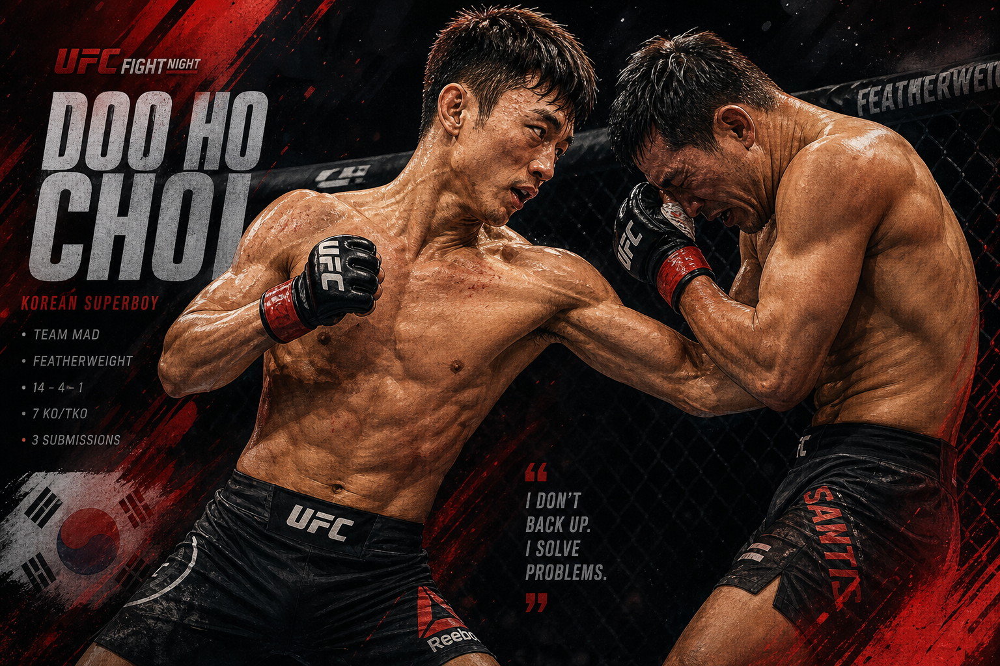
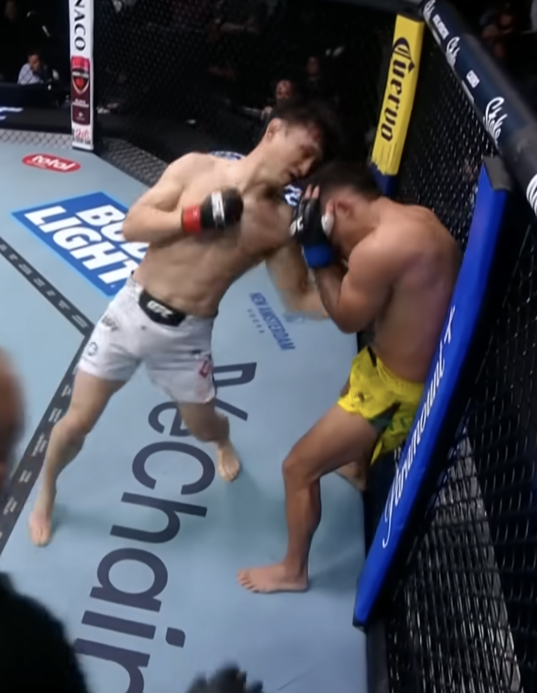

최두호의 **다니엘 산토스전 승리**는 결과만으로도 충분히 크다. 2026년 5월 16일 라스베이거스 메타 APEX에서 그는 2라운드 4분 29초, 바디샷 러시로 산토스를 꺾었다. UFC 공식 기록과 주요 해외 매체 보도를 종합하면 이 승리로 최두호는 **3연속 피니시**를 완성했고, UFC는 이 경기에 **파이트 오브 더 나이트 보너스**까지 붙였다. 단순히 “이겼다”가 아니라, **UFC가 다시 상품으로 본 경기**였다는 뜻이다.

이 지점이 생각보다 중요하다. UFC에서 어떤 선수는 이겨도 조용히 지나가고, 어떤 선수는 이긴 뒤 오히려 더 큰 질문을 남긴다. 최두호는 이번에 분명히 후자였다. 산토스전 뒤 붙은 관심은 “복귀전에 성공했네” 수준이 아니었다. **이 선수를 이제 어디까지 올려볼 수 있느냐**, **이 타이밍에 누구를 붙이면 가장 큰 반응이 나오느냐**, **한국 시장과 연결할 서사가 되느냐** 같은, 훨씬 더 큰 질문이 동시에 따라붙었다. 결국 시장은 승리의 숫자보다도, 그 승리가 남긴 다음 장면을 보고 움직인다. 이번 최두호의 승리는 바로 그 다음 장면을 강하게 열어버린 경기였다.

> <mark>산토스전 이후 최두호의 가치가 커진 이유는 승리 자체보다, UFC와 팬들이 “다음 상대를 궁금해하는 선수”로 다시 보기 시작했다는 데 있다.</mark>

더 흥미로운 건 경기 뒤의 흐름이다. 해외 매체들은 최두호의 피니시를 단순 KO가 아니라 “초반 열세를 읽고 뒤집은 승리”로 다뤘고, 한국 팬덤과 SNS 반응은 **“전성기 감각이 돌아왔다”**는 쪽으로 빠르게 기울었다. 여기에 5월 21일 **정찬성**이 SNS에 UFC와 연락을 주고받는 정황을 올리면서, 한국 팬들 사이에선 다시 한 번 **UFC 한국 이벤트 가능성**이 화두가 됐다. 아직 공식 발표는 없다. 하지만 최두호라는 카드와 이 소문이 붙는 순간, 이야기는 확실히 커진다.

결국 지금 최두호를 둘러싼 분위기는 세 층으로 나뉜다. 첫째는 **경기력에 대한 재평가**다. 둘째는 **매치메이킹 가치의 상승**이다. 셋째는 **한국 MMA 전체 서사와의 연결**이다. 이 세 층이 동시에 붙는 순간, 한 경기의 의미는 단순한 승패 기록을 넘어선다. 최두호는 지금 정확히 그 지점에 서 있다. 그래서 산토스전 이후의 기사는 단순한 경기 복기만으로는 부족하다. **왜 이 승리가 지금 더 크게 읽히는지**, **왜 다음 상대 이야기가 이전보다 훨씬 진지해졌는지**, **왜 정찬성의 짧은 SNS 한 장면이 최두호 기사 안으로 끌려들어오는지**를 함께 설명해야 설득력이 생긴다.

## 승리보다 더 크게 남은 건 반응이다

### 이 경기는 그냥 복귀전 승리가 아니었다

**MMA Fighting**은 최두호가 거친 초반을 넘긴 뒤 산토스를 “녹여버렸다”는 식으로 표현했고, UFC 공식 보너스 커버리지 역시 두 선수의 경기를 사실상 **파이트 오브 더 나이트급 난타전**으로 정리했다. 이런 표현은 중요하다. UFC는 모든 승리를 같은 톤으로 포장하지 않는다. **매치가 브랜드가 되는 순간**과 단순한 결과 발표는 다르다.

- **공식 결과**: 2라운드 TKO
- **공식 후속 평가**: 보너스를 받은 메인카드급 화제 경기
- **국제 매체 프레이밍**: 고전 후 수정, 그리고 폭발적인 마무리

즉, 이번 승리는 판정승 하나가 아니라 **서사가 붙는 승리**였다. 산토스는 이미 최근 한국 선수들을 연달아 이기며 “코리안 킬러” 프레임을 얻고 있었고, 최두호는 그 흐름을 직접 끊어낸 선수가 됐다. 여기서 팬덤 반응이 커지는 건 자연스럽다. 단순히 한국 선수가 이겼기 때문이 아니라, **극의 구조가 분명했기 때문**이다. 초반엔 밀렸고, 2라운드엔 읽었고, 마지막엔 접어버렸다.

이 구조는 파이터의 가치 평가에서 굉장히 강하다. UFC 팬들은 숫자만 보지 않는다. 특히 메인카드급 팬덤은 **경기 안에서 드라마가 있었는지**, **선수가 위기를 넘길 수 있는지**, **하이라이트가 맥락을 갖고 있었는지**를 본다. 산토스전의 최두호는 세 조건을 모두 채웠다. 1라운드만 잘하고 끝나는 선수가 아니었고, 한 방만 기다리는 복권형 타격가도 아니었다. 흐름을 내주고도 회수할 수 있었고, 회수한 흐름을 단순 판정 관리가 아니라 피니시로 연결했다. 그래서 이 승리는 “좋은 KO”보다 한 단계 더 높은 **좋은 스토리의 KO**로 읽힌다.

> **최두호의 바디샷 TKO는 예쁜 하이라이트가 아니라, 경기 안에서 정보를 회수한 뒤 내놓은 답안에 가까웠다.**

### 찬사의 핵심은 “여전히 재미있다”가 아니라 “다시 통한다”였다

최두호는 원래도 재미있는 선수였다. 문제는 오랫동안 그 재미가 **상위 경쟁력**과 같은 문장으로 읽히지 않았다는 데 있었다. 하지만 산토스전 뒤 반응은 조금 달랐다. 공개적으로 검색되는 반응을 보면 팬들은 “역시 최두호”에 머무르지 않고, **“지금 체급 문지기들과 붙여도 그림이 나온다”**는 쪽으로 말을 옮기고 있다.

이 차이는 크다. 어떤 파이터는 늘 재미있지만, 승패 예측에선 끝내 신뢰를 못 받는다. 그런 선수는 언제나 하이라이트 영상에선 강하지만, 매치메이킹 테이블에 올라가면 우선순위가 밀린다. 반대로 **재미와 경쟁력이 한 문장으로 묶이기 시작하는 순간**, UFC 안에서의 쓰임새는 급격히 넓어진다. 산토스전 뒤 최두호가 받은 찬사는 바로 그 전환의 냄새를 풍긴다. “오랜만에 멋있었다”가 아니라, **“지금 붙이면 진짜 변수를 만들 수 있다”**는 인식으로 넘어가는 것이다.

이는 최근 3연전의 결이 서로 다르기 때문이다.

- **빌 알지오전**은 거리와 타이밍이 살아 있음을 보여줬다.
- **네이트 랜드웨어전**은 난전 속 화력과 집중력을 증명했다.
- **산토스전**은 초반 흔들림 뒤 수정 능력까지 증명했다.

<u>상대가 달랐고, 승리 방식의 핵심도 달랐다는 점이 최두호를 다시 랭킹 이야기 안으로 밀어 넣는다.</u>

이건 파이터에게 아주 중요하다. UFC가 좋아하는 건 단지 3연승이 아니다. **다른 문제를 다른 방식으로 풀 수 있는 선수**다. 최두호는 최근 세 경기에서 같은 펀치로만 버틴 게 아니라, 서로 다른 전개 속에서 피니시를 만들었다. 그래서 이번 찬사는 “옛날 스타의 추억”이 아니라 **현재 진행형 기대감**에 더 가깝다.

조금 더 직설적으로 말하면, UFC는 최근의 최두호를 다시 **“편성하기 쉬운 선수”**로 보게 됐을 가능성이 높다. 누구와 붙여도 그림이 난다. 공격적인 압박형을 붙여도 액션이 나오고, 난전형을 붙여도 장면이 나온다. 그리고 이제는 단지 난타전만 하는 것이 아니라, **경기 안에서 해석을 바꾸는 흔적**까지 보여주고 있다. 이런 선수는 프로모션 입장에서 늘 가치가 올라간다. 팬에게도 재밌고, 해설자에게도 설명거리가 많고, 매치메이커에게도 다음 단계 실험이 가능하기 때문이다.

## 산토스전은 기술적으로도 가치가 높았다

### 1라운드 열세를 뒤집은 선수는 보통 더 높게 평가된다

산토스전의 진짜 의미는 1라운드에 있다. 산토스는 초반 압박, 짧은 연타, 빠른 전진 타이밍으로 최두호를 흔들었다. **MMA Fighting**도 첫 5분을 사실상 산토스 쪽 흐름으로 봤다. 그런데 최두호는 무너지지 않았고, 2라운드엔 전혀 다른 리듬으로 싸우기 시작했다.

- **1라운드**: 산토스의 압박과 연타가 우세
- **2라운드 초반**: 최두호가 타이밍 확인과 중심 회수를 시작
- **2라운드 후반**: 바디샷과 카운터가 누적되며 경기 종료

이 구도는 랭킹 문턱에서 특히 중요하다. 상위권으로 갈수록 완벽한 선제 장악은 어렵다. 대신 **밀릴 때 어떻게 다시 읽느냐**가 남는다. 산토스전은 최두호가 최소한 그 질문에 이전보다 훨씬 좋은 답을 줬다는 경기였다.

이게 왜 랭킹 이야기로 바로 이어지느냐면, 랭킹 하단부의 문지기들은 대부분 **초반 한 번의 성공으로 경기를 끝내주는 상대**가 아니기 때문이다. 그들은 압박을 섞고, 클린치를 섞고, 리듬을 흔들고, 첫 번째 설계를 막히면 두 번째 설계를 꺼낸다. 그런 선수들과 붙었을 때 필요한 건 순수 화력만이 아니라 **전개 수정 능력**이다. 산토스전은 물론 완전한 검증은 아니다. 하지만 적어도 “최두호는 1라운드에 흐름을 잃으면 끝난다”는 식의 낡은 문장을 그대로 두기 어렵게 만들었다. 이 변화는 생각보다 크다.

> <mark>최두호의 이번 승리를 높게 봐야 하는 이유는 피니시 장면보다, 피니시가 나오기 전 6~7분 동안 경기 해석을 바꿨기 때문이다.</mark>

### 바디샷 피니시는 앞으로의 매치업에도 바로 연결된다

압박형 선수에게 몸통 공격은 단순 추가 옵션이 아니다. **전진 자체를 늦추는 장치**다. 산토스처럼 템포를 밀어붙이는 선수에게 바디샷이 맞기 시작하면, 상체 반응뿐 아니라 발도 멈춘다. 그 순간부터 압박의 질이 달라진다.

최두호가 보여준 건 이론적으로도 꽤 반가운 그림이다.

- 머리만 노리는 파이터보다 읽히기 어렵다.
- 압박형 상대의 템포를 바꾸는 데 직접적이다.
- 카운터 스트라이커가 주도권을 되찾는 데 유리하다.

이 부분은 **패트리시오 핏불** 같은 상위권 문지기형 베테랑과 연결해서 봐도 중요하다. 헤드헌팅만 하는 선수라면 경험 많은 베테랑에게 읽히기 쉽다. 반대로 몸통과 직선을 같이 섞을 수 있다면, 상대는 전진할 때마다 계산을 다시 해야 한다.

더 설득력 있게 말하면, 바디샷은 최두호의 공격을 “센 펀치”에서 “구조를 흔드는 펀치”로 바꿔준다. 머리만 노리는 카운터는 맞히지 못하면 공회전하기 쉽지만, 몸통을 섞기 시작하면 상대의 스텝, 호흡, 압박 빈도, 심지어 테이크다운 진입의 질까지 함께 흔들 수 있다. 상위권과 싸우려면 단발성 충격보다도 이런 **누적성 손상**을 줄 수 있어야 한다. 산토스전의 마무리가 그래서 반갑다. 보기 좋은 피니시일 뿐 아니라, **앞으로 더 좋은 상대를 만났을 때도 재사용 가능한 승리 방식**처럼 보였기 때문이다.

## 정찬성의 존재는 이제 코너 밖에서도 커졌다

### 산토스전 뒤 가장 많이 함께 언급된 이름은 정찬성이었다

이번 경기 뒤 최두호와 함께 가장 많이 호출된 이름은 **정찬성**이었다. 국내 보도와 전후 맥락을 보면 최두호는 3월부터 서울에서 정찬성의 지도 아래 집중 캠프를 소화했고, 산토스전에서도 정찬성의 세컨드 역할은 분명한 존재감을 남겼다. 공개 반응에서도 “1라운드 뒤 조정”과 “코너의 개입”은 꽤 자주 언급됐다.

이건 가볍지 않다. 한국 MMA에서 정찬성은 단순한 선배가 아니다. **UFC에서 두 차례 타이틀에 도전했고, 한국 개최 카드의 상징이었던 인물**이다. 최두호의 부활 서사에 그 이름이 붙으면, 매치메이킹 차원에서도 이야기가 더 커진다. UFC가 좋아하는 건 단일 선수의 폼 상승만이 아니라, **국가 단위 서사와 연결되는 회복 서사**이기 때문이다.

게다가 정찬성은 지금 선수 경력을 넘어, 한국 MMA 시장에서 **스토리를 조직할 수 있는 인물**이기도 하다. 캠프를 만들고, 대회를 열고, 해외 스타를 부르고, 팬들이 반응할 문법을 안다. 그런 인물이 최두호의 최근 부활에 실질적으로 관여했다는 사실은 기사 안에서 매우 중요하다. 이건 단순 미담이 아니라 **해석의 축**이다. 최두호의 최근 변화가 우연히 벌어진 일이 아니라, 훈련 환경과 주변 설계가 바뀐 결과일 수 있다는 이야기이기 때문이다. 독자 입장에서도 이 축이 들어가야 “왜 이번엔 다르게 봐야 하느냐”가 더 잘 납득된다.

<ins>최두호의 최근 상승세는 개인 부활이면서 동시에 “정찬성 캠프 효과”라는 더 큰 이야기로 소비되고 있다.</ins>

### 5월 21일 SNS가 던진 건 사실보다 분위기다

5월 21일 정찬성이 SNS에 UFC와 연락을 주고받는 정황을 올리면서, 한국 팬들 사이에선 다시 **UFC 한국 이벤트**에 대한 추측이 퍼졌다. 여기서 분명히 선을 그어야 할 부분이 있다.

- **사실**: 정찬성의 SNS 게시물이 새로운 해석거리를 던졌다.
- **사실**: 2026년 5월 21일 현재 UFC의 공식 이벤트 페이지에는 한국 대회가 발표돼 있지 않다.
- **추정**: 해당 연락이 곧바로 한국 개최 협의라는 뜻인지는 아직 알 수 없다.

이 구분은 중요하다. 지금 단계에서 “한국 대회 확정”처럼 쓰면 과장이다. 그러나 반대로 완전히 무시하기도 어렵다. 정찬성은 한국 MMA 시장에서 **UFC와 직접 대화할 수 있는 몇 안 되는 얼굴**이고, 최근 ZFN 운영과 해외 스타 초청, 한국 팬덤 동원력까지 보여줬다. 그가 던진 짧은 신호 하나가 큰 파장을 만드는 건 이상한 일이 아니다.

중요한 건 그 게시물 하나가 곧바로 결론이 아니라는 점과, 그럼에도 그 게시물이 시장의 상상력을 움직였다는 점을 동시에 인정하는 것이다. 한국 팬들이 지금 이 신호에 민감하게 반응하는 이유는 단순한 희망회로 때문만은 아니다. **정찬성의 위상**, **최두호의 상승세**, **최근 한국 시장에서 다시 살아나는 관심도**, **흥행 가능한 얼굴의 부족**이 한꺼번에 맞물려 있기 때문이다. 그래서 이건 루머를 사실처럼 쓰는 문제가 아니라, **왜 이런 루머가 지금 더 세게 먹히는지**를 설명하는 문제에 가깝다.

> **아직 발표는 없지만, 정찬성의 SNS는 분명히 하나의 질문을 다시 살렸다. UFC가 한국 시장을 다시 실전 카드로 볼 수 있는가.**

## 그 추측이 왜 최두호와 연결되느냐

### 한국 카드가 열린다면 최두호는 거의 자동으로 중심 후보가 된다

이건 감상이 아니라 구조의 문제다. UFC가 한국 이벤트를 다시 연다면 누구를 전면에 세울 것인가. 정찬성은 이미 은퇴했고, 새로운 세대 중 아직 최상위 랭킹에 안착한 이름은 드물다. 그때 가장 먼저 떠오르는 카드는 자연스럽게 **최두호**다.

- 한국 팬들이 즉시 반응하는 인지도
- UFC가 이미 알고 있는 하이라이트 가치
- 최근 3연속 피니시라는 명확한 상승 흐름
- 정찬성과 연결된 서사

최두호는 단순히 “한국 선수라서” 필요한 카드가 아니다. **경기를 붙이면 반응이 보장되는 선수**라는 점이 더 중요하다. 한국 대회를 추진할 때 UFC가 필요한 건 국적만이 아니라, 메인카드와 포스터를 버틸 수 있는 캐릭터다. 최두호는 지금 그 조건을 거의 모두 다시 회복했다.

여기서 핵심은 최두호가 지금 **한국 카드의 장식물**이 아니라 **구조물**이 될 수 있다는 점이다. 어떤 선수는 한국에서 열리니까 넣는 카드가 되고, 어떤 선수는 그 선수가 있으니까 대회를 설명할 수 있는 카드가 된다. 최두호는 후자 쪽으로 다시 가고 있다. 팬들은 이미 이름을 알고 있고, 해외 팬들은 하이라이트 가치를 안다. 정찬성과 연결된 서사도 있고, 최근 경기력도 받쳐준다. 그러면 UFC 입장에선 “한국을 다시 열 수 있느냐”는 질문과 “그때 누구를 전면에 세우느냐”는 질문 사이의 간격이 훨씬 짧아진다.

<u>정찬성의 SNS와 최두호의 승리가 같은 타이밍에 겹친 순간, 팬들이 둘을 하나의 그림으로 묶는 건 무리한 비약만은 아니다.</u>

다만 여기서도 조심할 건 있다. 설령 UFC가 한국 개최를 검토 중이더라도, 최두호의 다음 경기 시점은 반드시 그 카드에 맞춰지지 않을 수 있다. 오히려 랭킹 문턱을 빨리 밟게 하려면 **한국 대회까지 기다리기보다 올해 안에 미국이나 아시아 중립 카드에서 한 번 더 싸우는 쪽**이 더 현실적일 수 있다.

## 핏불 콜아웃은 타이밍상 이해되지만, 판은 이미 바뀌었다

### 콜아웃 당시엔 말이 됐지만 지금은 그 이름값이 예전 같지 않다

최두호는 경기 후 옥타곤 인터뷰에서 **패트리시오 핏불**을 콜아웃했다. 당시만 해도 이해되는 선택이었다. 핏불은 오랜 벨라토르 제왕이었고, UFC에 막 진입한 이름값 있는 베테랑이었다. 하지만 5월 21일 현재 공식 UFC 랭킹 페이지를 보면 **핏불은 페더급 톱15 밖**에 있다. 반면 **아론 피코가 13위**에 올라 있다.

이건 매치의 의미를 바꾼다.

- 예전의 핏불전은 “랭킹 문지기 + 이름값”이었다.
- 지금의 핏불전은 “이름값은 남았지만 랭킹 메리트는 줄어든 카드”에 가깝다.

즉, 최두호가 핏불을 잡더라도 예전만큼 바로 랭크 인 명분이 커질지는 미지수다. 팬이 이해하기는 쉽지만, **랭킹 정치**로 보면 약간 애매해졌다.

이 애매함이 생각보다 중요하다. 좋은 매치와 좋은 커리어 선택은 종종 다르다. 팬 입장에서는 핏불이라는 이름 자체가 주는 매력이 있다. 벨라토르 레전드, 짧고 날카로운 카운터, 오래된 검증의 이력, 무엇보다 “최두호 vs 핏불”이라는 제목만으로도 그림이 난다. 하지만 선수의 랭크 인 계산으로 들어가면 이야기가 달라진다. **지금의 핏불을 잡았을 때 얼마나 많은 숫자가 따라오느냐**는 별개의 질문이다. 최두호가 지금 필요한 건 멋있는 이름 하나보다도, **이겼을 때 UFC가 랭킹 재진입을 진지하게 검토할 수밖에 없는 상대**다.

### 더 큰 문제는 핏불이 이미 다른 흐름 위에 있다는 점이다

여기서 사용자가 떠올린 **아론 피코는 더 이상 루머 단계의 이름이 아니다.** 핏불은 이미 **2026년 4월 11일 UFC 327**에서 피코에게 만장일치 판정패를 당했고, UFC 공식 후속 기사들은 피코가 커리어의 가장 중요한 반등을 만들었다고 평가했다. 이 패배 뒤 피코가 랭크 인했고, 핏불은 바깥으로 밀렸다.

핵심은 이 결과가 최근 서사의 무게중심을 이미 바꿔놨다는 점이다. 지금의 페더급 흐름에서 핏불은 “새로 들어온 거물”이 아니라, **UFC 안에서 다시 자리를 찾아야 하는 베테랑** 쪽에 더 가깝다. 다시 말해 최두호가 콜아웃한 이름은 여전히 크지만, **매치메이킹의 중심축**은 예전보다 옅어졌다.

그래서 지금 핏불을 해석할 때는 이름값과 현재값을 분리해야 한다. 이름값만 보면 여전히 큰 시험지다. 그러나 현재값만 보면, 이제 그는 상향 직행 티켓이라기보다 **서로 다른 방향의 필요가 만나는 경기**에 가까워졌다. 핏불은 UFC 안에서 다시 자기 위치를 확보해야 하고, 최두호는 랭킹 문턱을 밟아야 한다. 이런 조합은 성사될 수는 있어도, 성사 자체가 곧 최적 선택을 의미하진 않는다. 기사에서 이 미묘한 차이를 짚어줘야 독자가 “왜 콜아웃은 멋있었지만, 꼭 그 경기여야 하는 건 아닌지”를 납득할 수 있다.

> <mark>최두호가 핏불을 불렀다는 사실은 여전히 공격적이고 의미 있지만, 지금 시점의 핏불은 랭킹 사다리라기보다 이름값 테스트에 더 가깝다.</mark>

## 아론 피코 거론은 실제로 근거가 있는가

### 피코는 지금 이 체급에서 “떠오르는 새 이름”의 대표다

아론 피코는 핏불을 이긴 뒤 UFC 공식 랭킹 13위에 들어갔다. UFC 공식 후속 기사 역시 그 승리를 **“결정적으로 중요한 퍼포먼스”**로 정리했다. 피코는 단지 유망주가 아니다. 이미 벨라토르 시절부터 알고 있던 이름이 UFC 무대에서 다시 유효하다는 걸 증명한 선수다.

이 지점에서 최두호와 피코의 비교가 흥미로워진다.

- 둘 다 **피니시 기대치**가 큰 선수다.
- 둘 다 팬 친화적 스타일로 주목받는다.
- 둘 다 “다음 경기에서 진짜 랭커 문턱을 넘어설 수 있느냐”는 질문을 받고 있다.

그리고 “해외에서 최두호 다음 상대로 피코가 거론된다”는 말도 완전히 근거 없는 이야기는 아니다. 다만 여기서도 톤 조절이 필요하다. **공개적으로 확인되는 영어권 담론은 존재하지만, 그 규모가 아주 넓다고 단정할 정도까진 아니다.** 현재 확인 가능한 가장 선명한 사례는 2026년 5월 17일 **MMA Fighting**의 매치메이킹 팟캐스트 `On To the Next One`이다. 이 방송에서 알렉산더 K. 리는 산토스전을 치른 직후의 최두호를 두고 직접 **“I need to see Doo Ho Choi and Aaron Pico”**, 이어서 **“give me the Korean Superboy and Pico at some point. Maybe it’s not next. But if we could get it next…”**라고 말했다. 이건 단순한 이름 나열이 아니라, 산토스전 직후 “최두호의 다음 그림”을 논하는 자리에서 나온 구체적 제안이다. [출처](https://podscripts.co/podcasts/mma-fighting/on-to-the-next-one-matches-to-make-after-ufc-vegas-117)

여기에 커뮤니티 차원의 보조 근거도 있다. 영어권 최대 MMA 커뮤니티인 **r/MMA**에선 피코의 UFC 진입을 다루던 스레드에서 이미 **“Give him someone like Elkins, Fili or Doo Ho Choi”** 같은 식의 제안이 나온 바 있다. 물론 이건 산토스전 이후의 직접 반응은 아니고, 최두호-피코 조합이 영어권 팬들 머릿속에서 아예 낯선 매치업은 아니라는 정도의 보조선으로 봐야 한다. [출처](https://www.reddit.com/r/MMA/comments/1hqj8n2/former_bellator_standout_aaron_pico_is_a_free/) 즉, **공개 확인 가능한 수준에선 ‘일부 영어권 매체와 커뮤니티가 이 매치를 재미있는 그림으로 본다’까지는 말할 수 있지만, ‘해외 SNS 전체가 이 매치를 강하게 밀고 있다’고 쓰기엔 아직 증거가 얇다.**

하지만 둘의 위치는 아직 다르다. 피코는 이미 공식 랭킹 13위에 들어갔고, 최두호는 아직 바깥이다. 그래서 현실적으로 둘이 바로 붙을 가능성은 크지 않다. UFC는 보통 이런 경우 랭킹 안쪽 선수에게 랭킹 밖 화제 선수를 곧바로 주지 않는다. **특히 최두호처럼 이제 막 강한 흐름을 만든 선수에겐, 한 단계 아래의 확인 시험지를 먼저 주는 경우가 많다.**

오히려 피코를 지금 기사 안에서 중요한 이름으로 다뤄야 하는 이유는, 당장 싸울 확률보다도 **페더급의 속도가 어디로 가는지 보여주기 때문**이다. 피코는 이 체급이 단순히 오래된 이름들끼리 자리만 바꾸는 구간이 아니라는 걸 보여준다. 새 얼굴이 올라오고, 즉시 랭킹에 진입하고, 기존 거물의 자리를 흔든다. 최두호 입장에선 이게 기회이자 압박이다. 기회인 이유는 체급이 지금 유동적이라서다. 압박인 이유는, 이 타이밍을 놓치면 다음 파도에 묻힐 수도 있어서다. 그래서 “최두호가 올해 안에 한 번 더 싸워야 한다”는 결론은 단순 감정론이 아니라 **체급 흐름의 속도**에서도 나온다.

### 최두호에게 필요한 건 피코급 상징보다 랭킹 문지기급 현실이다

최두호가 정말 원하는 게 랭크 인이라면, 다음 상대는 아마 **피코처럼 이미 숫자를 가진 상승주**보다는 **11위~15위권과 맞닿은 문지기형 상대**가 더 현실적이다. 이름을 예쁘게 고르기보다, **이겼을 때 랭킹이 움직일 상대**가 중요하다.

- 핏불은 이름값은 크지만 랭킹 메리트가 줄었다.
- 피코는 랭킹 메리트는 크지만, 지금 붙기엔 UFC가 아껴둘 가능성이 크다.
- 결국 최두호에게 가장 현실적인 건 **문지기형 랭커 또는 직전권 선수**다.

<ins>최두호의 다음 상대는 팬서비스형 빅네임보다, 이겼을 때 숫자가 따라오는 상대여야 한다.</ins>

## 해외에서 붙는 이름들은 왜 비슷한 결을 갖는가

### 지금 영어권 담론에서 붙는 이름은 대체로 네 부류다

공개적으로 확인되는 영어권 매치메이킹 담론을 모아보면, 최두호의 다음 상대로 거론되는 이름들은 완전히 무작위가 아니다. **아론 피코**, **멜키자엘 코스타**, **데이비드 오나마**, **조시 에멧**, 그리고 그보다 조금 앞선 시점의 **브라이스 미첼**, **조앤더슨 브리토**까지, 붙는 이름들의 결이 의외로 비슷하다. 하나는 액션이 보장되는 공격형 파이터이고, 다른 하나는 랭킹과 시험지 성격을 가진 문지기 혹은 랭커다. 다시 말해 영어권도 최두호를 볼 때 **“재미있는 경기”와 “의미 있는 경기” 사이 어디쯤에 둘 것인가**를 두고 생각하고 있다는 뜻이다.

- **액션형 이름**: 피코, 멜키자엘 코스타, 브리토
- **랭킹 시험지형 이름**: 오나마, 에멧, 브라이스 미첼
- **공통점**: 전부 최두호의 강점인 타격전 서사와 팬 친화성을 살릴 수 있는 상대들

이게 중요한 이유는, 해외에서 최두호가 다시 소비되는 방식이 드러나기 때문이다. 예전의 최두호는 “추억의 액션파이터”로 소환되는 순간이 많았다. 그런데 지금 붙는 이름들을 보면 분위기가 조금 다르다. 단순히 “재밌으니까 붙여보자”가 아니라, **“이 선수에게 랭킹 문턱 시험지를 줄 만한가”**, 혹은 **“이 선수와 붙이면 확실한 화제 경기가 되겠는가”**라는 두 축 위에서 이야기가 움직인다. 이건 최두호가 다시 **현재형 매치메이킹 자원**으로 읽히기 시작했다는 뜻이다.

### 멜키자엘 코스타와 피코는 “무조건 재밌는 경기” 축이다

5월 17일 **MMA Fighting**의 `On To the Next One`에선 마이크 헥이 최두호의 다음 상대로 **멜키자엘 코스타**를 직접 제안했고, 알렉산더 K. 리는 그 직후 **아론 피코**를 이야기했다. [출처](https://podscripts.co/podcasts/mma-fighting/on-to-the-next-one-matches-to-make-after-ufc-vegas-117) 여기서 흥미로운 건 둘 다 랭킹 숫자보다 **불꽃이 붙는 그림**을 먼저 떠올리게 하는 이름이라는 점이다. 코스타는 전진 압박과 템포로 경기를 시끄럽게 만드는 타입이고, 피코는 폭발적인 레슬링-복싱 하이브리드와 강한 이름값을 동시에 갖고 있다. 둘 다 최두호와 만나면 경기 전부터 “이건 사고 난다”는 기대를 만들 수 있다.

이런 이름들이 먼저 붙는 건 최두호의 현재 이미지와도 맞아떨어진다. 최두호는 지금 점수 관리형 파이터로 소비되지 않는다. **기술적으로 더 성숙해졌다는 평가를 받으면서도, 여전히 액션의 중심에 서는 선수**로 읽힌다. 그러니 영어권 분석가나 팬이 “다음에 누구 붙이면 재밌냐”를 떠올릴 때, 자연스럽게 코스타나 피코 같은 이름이 나온다. 이건 단점이 아니라 장점이다. UFC에서 흥행성과 경쟁력이 동시에 엮이는 선수는 선택지가 넓어진다.

하지만 이 두 이름은 결이 다르기도 하다. 코스타는 비교적 현실적인 액션 매치업에 가깝고, 피코는 이름값과 상징성이 훨씬 큰 대신 실제 성사 가능성은 더 복잡하다. 그래서 기사에서 둘을 같은 줄에 세우더라도, **코스타는 “지금 당장 붙여도 되는 난전형 카드”**, **피코는 “영어권에서 상상하는 고폭발 매치업”** 정도로 온도차를 두고 읽는 게 맞다.

### 오나마와 에멧은 “이제 진짜 시험해보자” 축이다

같은 `On To the Next One` 말미의 리스너 제안에선 **최두호 vs 조시 에멧**, **최두호 vs 데이비드 오나마** 같은 이름도 등장한다. [출처](https://podscripts.co/podcasts/mma-fighting/on-to-the-next-one-matches-to-make-after-ufc-vegas-117) 또 **Cageside Press**는 4월 28일 데이비드 오나마 차기전 후보군을 언급하면서 **“Chepe Mariscal, Steve Garcia, Hyder Amil, Nathaniel Wood or Doo Ho Choi”**를 함께 넣었다. [출처](https://cagesidepress.com/2025/04/28/whats-next-ufc-kansas-city-winners-2/) 이건 액션 기대치 때문만은 아니다. 오나마나 에멧은 피코와는 다른 방식으로 최두호를 검증하는 이름들이다. 둘 다 **붙으면 재밌지만, 동시에 결과의 무게가 분명한 상대**다.

오나마는 최근 상승 흐름과 운동능력을 동시에 가진 선수라, 이기면 최두호의 랭킹 진입 명분이 단번에 커질 수 있다. 반대로 에멧은 커리어 후반부라도 여전히 강한 한 방과 랭킹 문법을 아는 베테랑이다. 최두호가 에멧이나 오나마 같은 이름과 붙는 순간, 그 경기는 더 이상 “복귀 서사의 다음 장”이 아니라 **랭킹 하단부 편입 시험**에 가까워진다. 영어권에서 이런 이름이 붙는다는 것 자체가 최두호를 다시 단순 액션파이터보다 높은 칸에 올려놓고 있다는 증거다.

여기엔 묘한 상징성도 있다. 피코나 코스타가 “와, 이 경기 재밌겠다”를 먼저 부른다면, 오나마와 에멧은 “좋아, 그럼 진짜 확인해보자”를 부른다. 영어권 담론이 이 두 축을 모두 쓰고 있다는 건, 최두호가 지금 **재미만 있는 카드**도 아니고 **숫자만 따지는 카드**도 아니라는 뜻이다. 그는 그 중간, 그러니까 UFC가 가장 자주 활용하는 **“화제성과 검증을 동시에 실험할 수 있는 슬롯”**에 올라와 있다.

### 브라이스 미첼과 브리토는 스타일 시험지로 읽힌다

조금 앞선 시점까지 넓혀 보면, 해외에서 최두호와 연결된 또 다른 이름은 **브라이스 미첼**과 **조앤더슨 브리토**다. **Cageside Press**는 2024년 12월 UFC 310 뒤 최두호의 다음 상대로 브라이스 미첼을 직접 매치메이킹했고, [출처](https://cagesidepress.com/2024/12/09/whats-next-ufc-310-winners/) 2025년 4월엔 브리토 차기전으로 최두호를 제안하며 “이 둘은 만들어지기만 하면 파이트 오브 더 나이트가 나올 수 있다”고 봤다. [출처](https://cagesidepress.com/2025/04/07/whats-next-ufc-vegas-105-losers/) 이 둘은 현재 당장 가장 뜨거운 이름은 아닐 수 있어도, 왜 최두호가 계속 여러 방향의 매치업에 걸리는지 잘 보여준다.

브라이스는 레슬링과 스크램블, 브리토는 전진성과 화력으로 최두호의 약점과 강점을 동시에 건드린다. 즉, 해외에서 최두호를 보는 시선이 단순히 “화끈하니까 아무나 붙여도 된다”가 아니라, **“타격전 서사는 확실한데, 레슬링 압박이나 난전 속 운영을 어디까지 통과하느냐가 궁금하다”** 쪽으로도 가 있다는 뜻이다. 이런 이름들이 붙는 건 결국 최두호에 대한 기대가 살아 있다는 이야기다. 의문이 없는 선수에겐 이런 시험지가 붙지 않는다.

> <mark>해외에서 최두호 다음 상대로 붙는 이름들을 보면, 최두호는 지금 “재밌는 선수”를 넘어 “누구를 상대로 검증할지 고민하게 만드는 선수”로 다시 올라와 있다.</mark>

## 그래서 올해 안에 한 번 더 싸울 가능성이 높다

### 나이와 흐름을 생각하면 지금이 가장 중요한 가속 구간이다

최두호는 이제 더 이상 “언젠가 키워볼 유망주”가 아니다. 커리어 후반부에 접어든 베테랑이자, 동시에 다시 뜨고 있는 흥행 카드다. 이 조합은 UFC가 오히려 **빠르게 한 번 더 쓰고 싶어 하는 조건**에 가깝다.

- 공백 뒤 복귀전에서 강한 피니시를 만들었다.
- 최근 3경기 연속 피니시라 홍보 포인트가 명확하다.
- 한국 시장 서사와도 연결된다.
- 랭크 인 직전이라 다음 한 번의 의미가 크다.

여기서 가장 비효율적인 선택은 너무 오래 쉬는 것이다. 폼이 식고, 관심이 흩어지고, 지금의 상승 곡선이 느슨해진다. 반대로 **2026년 안에 한 번 더 싸워 이기면**, 최두호의 하이프는 지금보다 더 커질 가능성이 높다. UFC가 좋아하는 건 연속성이다. 한 번 터진 화제보다, **두 번 연속으로 터지는 이야기**가 훨씬 세다.

특히 최두호처럼 공백의 시간이 길었던 선수는 리듬이 다시 붙었을 때 그 흐름을 살리는 쪽이 중요하다. 팬 입장에서도 “한 번 멋있었다”와 “연속해서 또 증명했다” 사이의 체감 차이는 크다. 첫 번째 승리는 기대를 만들고, 두 번째 승리는 기대를 신뢰로 바꾼다. 랭킹 바깥의 위험한 타격가가 랭킹 진입 후보로 격상되는 순간은 보통 바로 그 두 번째 검증에서 온다. 최두호는 지금 정확히 그 문 앞에 있다.

> **최두호는 지금 “언젠가 랭커와 붙을 선수”가 아니라, 올해 안에 랭커 혹은 랭킹 직전 문지기와 붙을 가능성이 높은 선수로 올라왔다.**

### 이기면 하이프는 지금보다 더 커질 수밖에 없다

산토스전 하나만으로도 최두호는 이미 다시 주목받고 있다. 그런데 다음 경기에서 랭킹 문턱의 선수를 넘기면 이야기는 완전히 달라진다. 그때부터는 “부활”이 아니라 **재진입**이라는 단어를 쓸 수 있다.

이 차이는 단어 선택 이상의 의미를 갖는다. 부활은 감정의 언어지만, 재진입은 구조의 언어다. 부활한 선수는 계속 감동적인 선수일 수 있지만, 재진입한 선수는 이제 타이틀 그림 안쪽에 아주 희미하게라도 발을 들여놓는다. 최두호가 지금 필요한 건 바로 그 변화다. “여전히 재미있는 선수”에서 “이제는 숫자를 줄 수도 있는 선수”로 넘어가는 순간 말이다. 산토스전은 그 가능성을 열었고, 다음 경기는 그 가능성을 서류처럼 찍어줄 시험지가 될 수 있다.

- **산토스전 승리**: 부활의 확인
- **다음 문지기전 승리**: 랭크 인 명분 확보
- **그 다음**: 진짜 상위권 검증

이 순서가 가장 자연스럽다. 그리고 지금 최두호의 위치는 정확히 그 두 번째 문 앞이다.

## 결론은 분명하다

최두호의 산토스전은 단순한 1승이 아니었다. **공식 보너스**, **국제 매체의 강한 프레이밍**, **정찬성과 연결된 서사**, **한국 이벤트 추측과의 접점**, **핏불-피코 구도의 변화**까지 겹치며 오히려 다음 한 경기를 더 크게 만들었다.

지금 시점에서 사실로 말할 수 있는 건 네 가지다.

- 최두호는 산토스를 꺾고 3연속 피니시를 완성했다.
- UFC는 그 경기를 보너스로 보상할 만큼 주목했다.
- 핏불은 현재 공식 톱15 밖이고, 피코는 13위에 들어가 있다.
- UFC의 공식 한국 개최 발표는 아직 없다.

그리고 그 사실들 위에서 가장 설득력 있는 해석은 이것이다.

> <mark>최두호는 이제 랭커와 싸울 가능성이 높고, 랭크 인할 가능성도 높다. 올해 안에 한 번 더 싸울 가능성 역시 높다. 그리고 그 경기까지 이긴다면, 지금의 찬사는 곧바로 더 큰 하이프로 바뀔 수 있다.</mark>

결국 핵심은 랭킹 숫자 하나가 아니다. **최두호는 다시 미래를 말할 수 있는 선수**가 됐다. UFC가 한국 시장을 다시 만지기 시작하든, 아니면 미국 카드에서 곧바로 문지기 시험지를 던지든, 지금 최두호는 어느 쪽에도 어울리는 위치에 있다. 산토스전은 끝난 경기지만, 최두호 이야기의 크기로 보면 오히려 이제 시작에 가깝다.

그래서 이 기사의 결론은 단순 낙관론이 아니다. 최두호가 당장 타이틀 컨텐더가 됐다고 말하는 것도 아니고, 정찬성의 SNS가 곧 한국 대회를 뜻한다고 단정하는 것도 아니다. 대신 지금 확인된 사실들을 차분히 놓고 보면, **최두호가 다시 큰 이야기의 중심으로 들어올 조건이 빠르게 갖춰지고 있다**는 건 충분히 말할 수 있다. 경기력은 살아났고, 반응은 커졌고, 체급의 판도는 움직이고 있고, 한국 시장 서사와 연결되는 축도 있다. 이 네 가지가 동시에 겹치는 시점은 자주 오지 않는다. 그렇기 때문에 지금 최두호의 다음 한 경기는 승패 이상의 의미를 갖는다. **그건 단지 한 번 더 싸우는 경기가 아니라, 최두호가 다시 어디까지 갈 수 있는지를 UFC 전체에 설명하는 경기**가 될 가능성이 높다.
