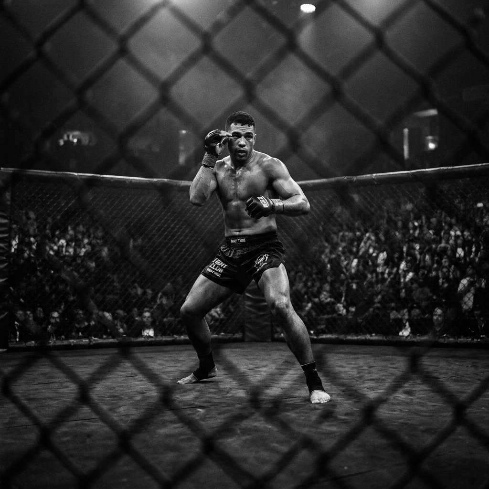

최근 옥타곤에서는 전통적인 복싱 스탠스보다 무에타이 스탠스를 차용한 타격가들의 활약이 두드러지고 있습니다. 이는 **카프킥(Calf Kick)**의 유행과 밀접한 관련이 있습니다.

과거에는 체중을 앞발에 싣는 넓은 스탠스가 테이크다운 방어와 강한 펀치를 내는 데 유리했습니다. 하지만 앞발에 체중이 실린 상태에서는 상대의 빠르고 날카로운 카프킥을 방어하기가 매우 어렵습니다.

### 카프킥과 스탠스의 변화
카프킥을 맞게 되면 앞발의 비골 신경이 마비되어 스텝을 밟거나 체중을 싣는 것 자체가 불가능해집니다. 이를 방어하기 위해 파이터들은 점차 앞발을 가볍게 두고 언제든 정강이로 블로킹(Check)을 할 수 있는 무에타이 특유의 좁고 꼿꼿한 스탠스를 채택하고 있습니다.

> "거리 조절의 핵심은 앞발의 자유로움에 있습니다. 묶인 앞발은 곧 패배를 의미합니다."

물론 꼿꼿한 스탠스는 레슬러들의 테이크다운에 취약하다는 단점이 있습니다. 따라서 현대의 엘리트 타격가들은 무에타이 스탠스를 기본으로 하되, 찰나의 순간에 레벨 체인지를 방어할 수 있는 독자적인 거리 감각을 완성해 나가고 있습니다.
