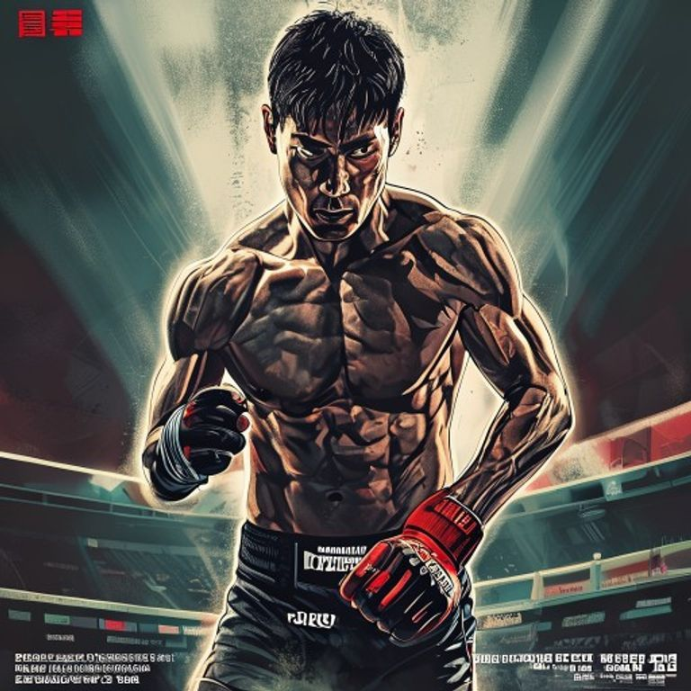
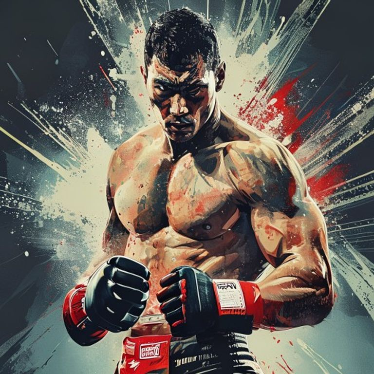

한국 MMA에서 **황인수**는 보기 드문 존재다. 한 방으로 분위기를 뒤집을 수 있고, 등장만으로 카드의 공기를 바꾼다. **하동호**는 아직 선수보다 코치와 현장 운영자의 얼굴로 더 많이 소비되지만, 코리안좀비MMA와 **ZFN** 생태계 안에서는 이미 무시하기 어려운 존재감이 됐다. 문제는 그 존재감이 커질수록, 두 사람 모두에게 비슷한 질문이 더 선명해진다는 점이다.

> "눈에 띄는 사람은 많다. 하지만 강하게 보이는 것과 깊게 증명하는 것은 전혀 다른 문제다."

이 글은 두 사람의 **사생활**이나 확인되지 않은 소문을 다루려는 글이 아니다. 공적으로 드러난 **경기 내용**, **코칭 결과**, **퍼포먼스의 구조적 약점**을 중심으로 본다. 그리고 냉정하게 말하면, 두 사람 모두 지금까지는 <mark>강렬한 인상에 비해 완성도는 아직 덜 증명된 인물</mark>로 읽힌다.

### 1. 황인수의 첫 번째 단점은, 여전히 경기가 단선적으로 풀릴 때가 많다는 점이다

황인수의 장점은 모두가 안다. 강한 펀치, 압박감, 상대를 얼어붙게 만드는 존재감. 그러나 그 장점이 너무 선명한 탓에 단점도 같이 드러난다. **공격의 설계가 길게 이어지지 않을 때가 많다.** 첫 압박과 첫 충돌이 먹히지 않으면, 그 다음 문장을 어떻게 이어 갈 것인가가 아직 완전히 정리된 선수처럼 보이진 않는다.

2025년 9월 17일 **DWCS**에서의 패디 맥코리전은 이 약점을 가장 잔인하게 드러낸 경기였다. UFC와 ESPN 집계 기준으로 황인수는 그 경기에서 만장일치 판정패를 당했고, 유효타 수치에서도 크게 밀렸다. 국내 보도 역시 “기대 이하의 경기력”, “다채롭지 못한 경기 구성”을 강하게 지적했다. 이건 단순히 한 번 진 경기의 문제가 아니었다. **상대가 거리, 템포, 기동력을 가져가 버리자 황인수의 위협이 생각보다 빨리 평면화됐다**는 뜻이기 때문이다.

- **첫 번째 한계**: 폭발력은 있는데, 라운드 단위의 조정 능력은 아직 들쭉날쭉하다.
- **두 번째 한계**: 상대가 먼저 그림을 그리기 시작하면, 황인수 쪽 선택지가 단순해질 때가 있다.
- **세 번째 한계**: 강한 인상을 주는 것과, 높은 레벨의 상대를 읽으며 이기는 것은 다르다.

<u>황인수는 무서운 타격가다. 하지만 아직은 “복합적으로 어려운 시험지”를 만나면 답안이 얇아지는 순간이 있다.</u>

### 2. 황인수의 두 번째 단점은, 말의 크기와 경기의 정교함이 항상 비례하지 않는다는 점이다

황인수는 원래 조용한 선수 타입이 아니다. 자신감도 크고, 표현도 세다. 어떤 팬에게는 그게 스타성이다. 하지만 그 캐릭터는 동시에 독이 된다. **큰 언어를 쓰는 선수는, 큰 경기에서 더 정교한 증명을 요구받기 때문**이다.

실제로 황인수는 로드FC 챔피언, ZFN 메인 이벤트 승자라는 이력을 쌓아 왔지만, 그 과정 내내 “그래플링 압박을 정교하게 섞는 상대에게도 같은 방식이 통하는가”라는 질문이 따라붙었다. 2026년 5월 9일 **ZFN 04**에서 알렉스 폴리지를 TKO로 잡은 경기는 분명 좋은 결과였다. 다만 그 경기 역시 초반에는 테이크다운 시도와 압박에 흔들리는 장면이 있었고, 완벽한 선언문 같은 경기라고 보기는 어려웠다.

> **황인수의 문제는 약하다는 게 아니다. 오히려 강한데, 그 강함이 늘 입체적으로 구현되지는 않는다는 데 있다.**

- **캐릭터의 역풍**: 세게 말할수록, 팬은 더 세밀한 증명을 요구한다.
- **경기 운영의 숙제**: 압도적인 피니시가 나오지 않는 날에도, 판정형 운영으로 경기를 잠글 수 있어야 한다.
- **상대별 대응력**: 타격가 상대로 강한 것과, 타격과 그래플링을 섞는 국제전 스타일 상대로 강한 것은 다른 문제다.

결국 황인수의 단점은 한 문장으로 요약된다. **너무 강한 장점 하나가, 아직 덜 다듬어진 나머지 영역을 가려 왔다.** 그래서 그는 늘 기대를 크게 부르고, 그 기대를 완전히 수금하지 못했을 때 더 큰 실망을 남긴다.

### 3. 하동호 코치의 가장 큰 단점은, 존재감에 비해 검증된 코칭 이력이 아직 너무 얇다는 점이다

하동호는 지금 한국 MMA 팬들에게 낯선 이름은 아니다. 공적 보도에서도 그는 코리안좀비MMA의 코치로 소개됐고, 2024년 **최승우**의 캠프 기사에서도 **정찬성**과 함께 준비를 돕는 코치진으로 언급됐다. 하지만 바로 그 지점에서 질문이 생긴다. **하동호는 얼마나 많이, 얼마나 높은 무대에서, 얼마나 반복적으로 코칭 역량을 증명했는가.**

공개적으로 확인되는 이력만 놓고 보면, 하동호는 화려한 선수 커리어나 두터운 엘리트 코칭 레퍼런스로 설명되는 인물은 아니다. Tapology에 공개된 기록상 선수 경력도 매우 짧고, 대중이 확인할 수 있는 코칭 성과 역시 아직은 “정찬성의 시스템 안에서 존재감이 커진 인물” 이상으로 정리되기 어렵다. 이것은 인신공격이 아니라 구조의 문제다. **눈에 띄는 자리로 먼저 올라왔지만, 그 자리를 단단하게 뒷받침할 공적 샘플은 아직 적다.**

- **가장 큰 약점**: 코치로서의 신뢰가 결과보다 이미지와 근접성에 먼저 기대는 인상을 준다.
- **검증의 부족**: 특정 선수 하나가 잘 풀린 사례가 아니라, 여러 유형의 선수에게 반복 가능한 성과가 필요하다.
- **역할의 모호함**: 기술 코치, 전략 코치, 매니저형 조력자, 콘텐츠형 인물의 경계가 아직 선명하지 않다.

<mark>좋은 코치는 존재감이 아니라, 선수의 경기 안에서 반복적으로 번역되는 사람이어야 한다.</mark>

### 4. 하동호 코치의 두 번째 단점은, 코칭이 전술보다 분위기와 동행의 언어로 읽힐 때가 있다는 점이다

좋은 코너맨은 단순히 옆에 있어 주는 사람이 아니다. 라운드 사이에 **무슨 정보를 버리고, 무슨 정보만 남겨서, 선수가 즉시 행동으로 옮기게 하느냐**가 중요하다. 그런데 하동호를 둘러싼 공개적 인상은 아직 이 지점에서 선명하지 않다.

정찬성 시스템 안의 코치진은 종종 강한 동기부여, 팀 분위기, 결속감으로 주목받는다. 그건 장점일 수 있다. 하지만 코너에서 필요한 건 결국 **정서적 고양**이 아니라 **기술적 번역**이다. 선수가 라운드 안에서 막히고 있을 때 “더 세게”, “더 자신 있게”보다 중요한 건, 어느 각도로 빠지고 어느 타이밍에 레벨 체인지 페인트를 섞으며 어느 손으로 선행타를 깔아야 하는지에 대한 명확한 언어다.

하동호 코치를 향한 의문도 여기서 나온다. 그의 코칭이 정말로 선수의 경기 안에서 **정교한 수정 능력**으로 나타나는지, 아니면 아직은 팀의 에너지와 현장 존재감이 더 크게 보이는지 말이다. 이 질문은 불편하지만 피하기 어렵다.

> **코치는 열정으로 기억될 수 있다. 그러나 오래 남는 코치는 수정 능력으로 증명된다.**

- **분위기 의존 위험**: 팀 결속과 현장 에너지가 전술의 빈틈을 가릴 수 있다.
- **코너 언어의 숙제**: 위기 상황에서 즉시 실행 가능한 지시가 얼마나 축적돼 있는지가 중요하다.
- **큰 무대 적응력**: 로컬 무대의 분위기 메이킹과 상위 무대의 실전 조정 능력은 다르다.

### 5. 황인수와 하동호의 조합이 불안한 이유는, 두 사람의 단점이 서로를 상쇄하기보다 닮아 있기 때문이다

가장 좋은 선수-코치 조합은 서로의 약점을 메운다. 예컨대 감정적이고 폭발적인 선수라면, 코치는 차갑고 구조적인 언어를 줘야 한다. 반대로 선수가 지나치게 소극적이면, 코치는 압박과 결단을 끌어올려야 한다.

그런데 황인수와 하동호를 둘러싼 현재의 인상은 약간 다르다. 둘 다 **에너지**, **존재감**, **현장 임팩트** 쪽으로 강하게 읽힌다. 이 말은 곧, 정교함과 구조가 필요한 순간에 오히려 같은 종류의 빈칸이 남을 수 있다는 뜻이기도 하다.

- **황인수의 빈칸**: 복합적 대응과 라운드 단위 조정.
- **하동호의 빈칸**: 코칭 결과의 반복 증명과 역할의 선명성.
- **조합의 리스크**: 강한 분위기가 강한 설계를 대신하는 것처럼 보일 수 있다.

<ins>그래서 이 조합은 흥미롭지만, 아직 안심되지는 않는다.</ins>

### 6. 결론: 두 사람의 단점은 치명적이라기보다, 이제 더는 숨길 수 없는 종류의 약점이다

황인수는 여전히 한국 MMA에서 가장 위협적인 타격가 중 하나다. 하동호 역시 한국 로컬 씬에서 점점 더 큰 자리를 차지하고 있다. 그래서 더 냉정해야 한다. 지금 두 사람에게 필요한 건 “잠재력이 있다”는 칭찬이 아니라, **어디가 아직 비어 있는지 정확히 말해 주는 비평**이다.

황인수의 단점은 분명하다. **강한 화력에 비해 경기의 문법이 아직 단선적으로 읽힐 때가 있다.** 하동호의 단점도 분명하다. **눈에 띄는 역할에 비해, 코치로서의 공적 검증 샘플이 아직 충분하지 않다.** 이 둘은 욕이 아니라 진단에 가깝다.

하지만 진짜 중요한 건 그 다음이다.

> <mark>단점이 있다는 사실보다 더 위험한 건, 그 단점을 캐릭터와 분위기로 덮으려 드는 순간이다.</mark>

한국 MMA는 이제 그런 덮개를 오래 허용하지 않는다. 팬들도 더 많이 보고, 더 빨리 비교하고, 더 정확하게 기억한다. 황인수와 하동호가 다음 단계로 가려면 필요한 것은 더 큰 말이 아니라 더 정교한 증명이다. 결국 케이지와 코너는 같은 질문을 던진다. **강해 보이는가, 아니면 정말로 더 완성되어 가고 있는가.**

---
**참고한 공개 자료**
- Tapology 황인수 전적 페이지
- ESPN 황인수 경기 기록 및 DWCS 타격 수치 페이지
- UFC KR 황인수 DWCS 관련 기사
- 더팩트 황인수 DWCS 경기력 비판 기사
- MooZine ZFN 04 경기 리포트
- 조선일보/뉴시스 계열 최승우 캠프 기사 내 하동호 코치 언급
- Tapology 하동호 선수 페이지
