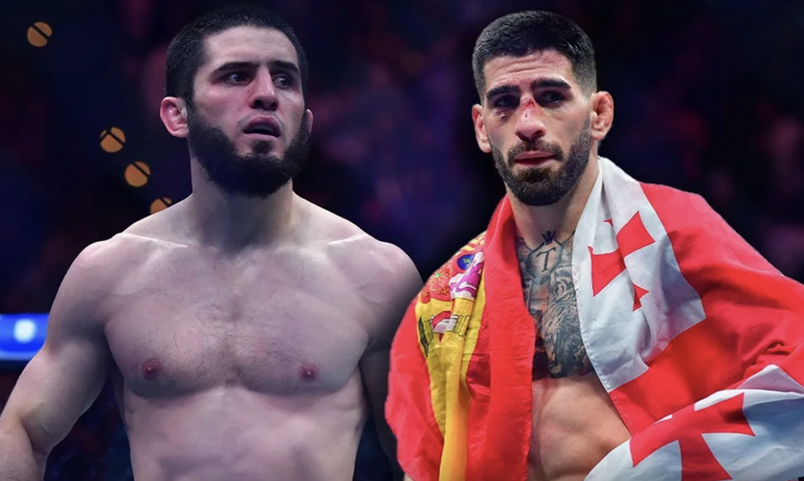

2026년 5월 19일 현재, **일리아 토푸리아**와 **이슬람 마카체프**는 UFC가 보유한 가장 비싼 이름 두 개에 가깝다. **마카체프**는 2025년 11월 **UFC 322**에서 **잭 델라 마달레나**를 꺾고 웰터급 챔피언이 됐고, UFC 공식 파운드포파운드 랭킹에서도 1위를 지키고 있다. **토푸리아**는 2025년 6월 **UFC 317**에서 **찰스 올리베이라**를 KO로 제압해 공석이던 라이트급 타이틀을 차지했고, 현재는 6월 14일 백악관에서 열리는 **UFC Freedom 250**에서 잠정 챔피언 **저스틴 게이치**를 상대로 첫 방어전을 앞두고 있다.

이 두 이름을 한 문장 안에 넣는 순간, 모든 MMA 팬의 상상력은 거의 같은 그림으로 향한다. “지금 UFC가 만들 수 있는 가장 큰 경기 아닌가.” 맞다. 다만 그다음 질문이 더 중요하다. **정말 붙을 수 있는가. 그리고 붙는다면 누가 유리한가.**

> "큰 경기와 가능한 경기는 다르다. 토푸리아와 마카체프는 바로 그 틈에서 가장 뜨겁게 불타는 슈퍼파이트다."

이번 글은 희망회로가 아니라, 현재 공개된 일정과 발언, 국내외 칼럼과 뉴스, 영상 분석에서 공통으로 드러나는 사실들을 바탕으로 이 매치를 최대한 차갑게 해부하려는 시도다. <mark>결론부터 말하면, 이 경기는 엄청나게 크지만 당장 성사될 확률은 생각보다 높지 않다. 대신 한 번만 문이 열리면 UFC 전체의 권력 지형을 다시 쓸 수 있는 카드이기도 하다.</mark>

### 1. 성사 가능성부터 보면, 지금은 “뜨겁지만 즉시 현실적이진 않은 경기”에 가깝다

가장 먼저 정리해야 할 건 일정이다. **토푸리아**는 이미 2026년 6월 14일 **UFC Freedom 250** 메인 이벤트에서 **게이치**와 라이트급 타이틀전을 치르기로 잡혀 있다. UFC 공식 이벤트 페이지와 백악관 카드 발표 보도는 이 점을 분명히 못박고 있다. 반면 **마카체프**는 웰터급 챔피언으로 올라선 뒤, 여러 인터뷰와 보도를 통해 토푸리아전 자체를 완전히 부정하진 않았지만, 적어도 **당장 백악관 카드에서 이 매치를 할 계획은 없다**는 쪽에 더 가까운 신호를 줬다.

이게 의미하는 건 단순하다.

- **단기 성사 가능성**: 낮다. 토푸리아가 이미 게이치전으로 묶여 있다.
- **중기 성사 가능성**: 조건부로 높다. 토푸리아가 게이치를 넘고, UFC가 라이트급 수비전보다 슈퍼파이트를 더 크게 볼 경우다.
- **가장 현실적인 체급**: 지금 시점에선 155파운드보다 170파운드 쪽이 더 현실적이다.

여기서 핵심은 체급 정치다. 마카체프는 이미 라이트급을 떠나 웰터급 챔피언이 됐다. 이런 상황에서 그가 굳이 다시 내려와 토푸리아와 붙을 유인은 크지 않다. 반대로 토푸리아는 지금 라이트급 챔피언이고, 곧 첫 방어전을 치른다. 즉 **실제로 이 경기가 성사된다면, 토푸리아가 올라가는 그림이 더 자연스럽다.**

<u>팬들이 상상하는 “라이트급 왕좌 결정전”과, UFC가 실제로 만들 가능성이 있는 “웰터급 슈퍼파이트”는 같은 경기가 아니다.</u>

### 2. 토푸리아에게 유리한 건 짧은 순간의 폭발력이고, 마카체프에게 유리한 건 경기 전체의 구조다

상성만 놓고 보면 이 매치는 너무 뻔해서 오히려 복잡하다. **토푸리아**는 현재 UFC에서 가장 날카로운 복싱형 피니셔 중 하나다. 짧은 거리에서의 펀치 정확도, 몸통과 안면을 잇는 압박, 그리고 한번 리듬을 읽었을 때 상대를 끝까지 몰아붙이는 파괴력은 이미 **볼카노프스키**, **할로웨이**, **올리베이라** 같은 이름들 앞에서 증명됐다.

반면 **마카체프**는 “어떻게 이기는가”가 너무 분명한 선수다. 긴 거리에서 왼발 킥과 잽으로 상대의 전진을 묶고, 펜스로 몰아 클린치와 체인 레슬링으로 선택지를 지운다. 상위 포지션에서 데미지까지 꼭 폭발적으로 내지 않더라도, **상대가 자기 경기를 하지 못하게 만드는 능력**이 탁월하다.

- **토푸리아의 최고 장점**: 짧은 교환에서 경기 자체를 끝내는 능력
- **마카체프의 최고 장점**: 짧은 교환이 길어지기 전에 아예 경기 구조를 자기 쪽으로 바꾸는 능력
- **결국의 질문**: 토푸리아가 먼저 맞히느냐, 마카체프가 먼저 붙잡느냐

> **이 매치는 화력 대 화력이 아니다. 토푸리아는 순간을 지배하려 하고, 마카체프는 시간을 지배하려 한다.**

토푸리아가 이기려면 교환 자체를 짧게 끝낼 수 있어야 한다. 반대로 마카체프가 원하는 건 교환을 끝내지 않고, 그 뒤의 연결까지 끌고 가는 것이다. 그래서 이 경기는 보기보다 단순한 타격 vs 그래플링 프레임으로 환원되지 않는다. 오히려 **누가 자기 강점이 열리는 길이로 라운드를 자를 수 있느냐**가 핵심이다.

### 3. 체급이 155냐 170이냐에 따라 예측은 크게 달라진다

이 경기를 분석할 때 가장 많이 생략되는 부분이 바로 여기다. 팬들은 종종 “토푸리아와 마카체프가 붙으면 누가 더 잘하나”만 묻는다. 하지만 실제로는 **어디서 붙느냐**가 너무 중요하다.
만약 이 경기가 155에서 열린다면, 토푸리아 쪽 이야기가 조금 달라진다. 라이트급 타이틀을 이미 차지했고, 올리베이라를 1라운드에 끝낸 경험은 그가 상위 라이트급의 펀치와 속도에도 충분히 적응했다는 뜻이다. 이 경우 토푸리아의 복싱 압박과 바디샷, 특히 킥 이후 진입하는 카운터는 마카체프에게 꽤 불편한 질문이 될 수 있다. 마카체프가 라이트급에서 워낙 크다고는 해도, **토푸리아가 155에서 보여주는 폭발적 타이밍**은 단순히 “작은 선수의 무모한 도전”으로 보기 어렵다.

하지만 170이라면 얘기가 달라진다. 마카체프는 이미 웰터급 타이틀을 따내며 그 체급의 물리적 문제를 해결한 선수로 보이고, 토푸리아는 그 체급에서 아직 검증된 적이 없다. 클린치 하중, 레슬링 연결, 상위 포지션 압박, 그리고 한 라운드 한 라운드가 길어질 때의 완력 차이는 170에서 훨씬 더 크게 체감될 가능성이 높다.

- **155에서의 그림**: 토푸리아가 생각보다 더 실전적인 위협이 된다.
- **170에서의 그림**: 마카체프의 구조적 우위가 크게 커진다.
- **현실적 문제**: 현재 UFC 흐름상 실제 성사될 가능성이 높은 쪽은 170에 더 가깝다.

<mark>이 경기의 냉정한 해석은 “토푸리아가 마카체프를 잡을 수 있나”가 아니라, “토푸리아가 어떤 체급에서 마카체프의 구조를 흔들 수 있나”에 더 가깝다.</mark>

### 4. 예상 전략은 의외로 단순하다. 토푸리아는 중앙을 지켜야 하고, 마카체프는 펜스를 만들어야 한다

전술적으로 보면 둘의 게임플랜은 오히려 예상하기 쉽다. **토푸리아**는 최대한 중앙 공간을 오래 유지해야 한다. 원투나 체크 훅 그 자체보다 중요한 건, 마카체프의 첫 접촉 이후 각도를 바꾸며 다시 중앙을 차지하는 능력이다. 그는 상체 반응을 읽고 몸통을 건드리는 데 탁월하므로, **마카체프의 왼 킥이나 레벨 체인지 준비동작에 카운터를 꽂는 그림**이 가장 유효하다.

반면 **마카체프**는 정면 난타전을 길게 둘 이유가 전혀 없다. 그는 잽과 킥으로 토푸리아의 전진을 먼저 멈추고, 케이지 쪽으로 몰아 클린치와 레그 트립, 바디락, 싱글렉 연결을 반복할 가능성이 높다. 토푸리아가 첫 방어는 해내더라도, 마카체프는 보통 거기서 멈추지 않는다.

- **토푸리아의 전략**
중앙 유지, 바디샷, 첫 진입 카운터, 짧은 순간의 대형 데미지
- **마카체프의 전략**
거리 봉쇄, 펜스 압박, 체인 레슬링, 긴 시간의 누적 지배
- **가장 큰 전술 포인트**
토푸리아가 첫 테이크다운 방어 후 다시 중앙을 회수할 수 있는가

토푸리아의 장점은 상대를 얼게 만드는 펀치 위협이고, 마카체프의 장점은 상대가 그 펀치를 꺼내기도 전에 결정을 늦추게 만드는 압박이다. 그래서 초반 1라운드가 아주 중요하다. 토푸리아가 첫 큰 적중을 만들면 경기가 완전히 바뀔 수 있다. 반대로 마카체프가 첫 클린치와 첫 상위 컨트롤을 길게 가져가면, 이후 라운드는 점점 그의 세계가 된다.

### 5. 냉정한 승부 예측: 지금 기준으로는 마카체프가 조금 더 높은 확률의 해답이다

팬심을 잠시 빼고 보면, 나는 지금 시점의 이 매치업을 **마카체프 우세**로 본다. 다만 그 우세가 “토푸리아가 모자라서”가 아니라, **현실적으로 성사될 장소가 170에 더 가깝고, 그 조건이 마카체프에게 너무 유리하기 때문**이다.

만약 170에서 붙는다면 내 체감은 대략 이렇다.

- **마카체프 우세**
클린치와 체인 레슬링, 체급 하중, 장기전 운영
- **토푸리아의 승리 루트**
초중반에 카운터와 바디 공략으로 큰 데미지를 만들어 구조 자체를 끊는 것
- **가장 그럴듯한 결과**
마카체프의 판정승 혹은 후반 서브미션

155에서 붙는 순수 상상전이라면 격차는 더 줄어든다. 오히려 그 경우엔 토푸리아의 파괴력이 훨씬 실제적인 공포가 된다. 그래도 현재 기준의 “가장 현실적인 예측”은 마카체프 쪽이다. 웰터급 챔피언이 된 뒤의 그는 단지 더 큰 선수가 된 것이 아니라, **체급을 올리고도 자신의 게임이 그대로 통한다는 걸 이미 증명한 선수**이기 때문이다.

> "토푸리아가 더 위험한 순간을 만들 수는 있다. 그러나 마카체프는 그 순간이 열리는 경기 자체를 줄이는 데 훨씬 능하다."

### 6. 결과에 따라 MMA 전체에 미칠 영향은 생각보다 훨씬 크다

이 경기가 단순히 챔피언 대 챔피언으로만 끝나지 않는 이유는, 승자가 받아갈 상징이 너무 크기 때문이다.

**토푸리아가 이긴다면**, 그건 단순 업셋이 아니다. 전 페더급 챔피언이 라이트급을 정복한 뒤, 웰터급 챔피언이자 P4P 1위를 꺾는 그림이 된다. UFC 역사상 가장 빠르게 “시대의 얼굴”로 올라서는 케이스 중 하나가 될 수 있고, 복싱 중심의 압박형 스타일이 다게스탄식 지배를 무너뜨렸다는 상징도 생긴다. 그 순간 토푸리아는 단순 챔피언이 아니라, **현대 UFC의 중심 서사**가 된다.

**마카체프가 이긴다면**, 이건 또 다른 수준의 역사화다. 이미 라이트급 시대를 지배한 선수가 웰터급 챔피언까지 된 뒤, 그 체급 아래에서 가장 뜨거운 이름을 제압하는 그림이 된다. 그러면 마카체프는 단순히 강한 챔피언이 아니라, **체급을 옮겨도 게임이 무너지지 않는 세대형 지배자**라는 위치까지 올라간다. GOAT 논쟁에서도 더 이상 주변부가 아니라 중심부로 들어갈 가능성이 크다.

- **토푸리아 승리의 파장**: 새로운 P4P 왕, 복싱형 압박의 상징성, 트리플 챔프 서사 가속
- **마카체프 승리의 파장**: 다체급 지배 정당화, GOAT급 서사 강화, 다게스탄식 지배의 재확인
- **UFC 전체에 미칠 영향**: 라이트급과 웰터급 컨텐더 체인이 한꺼번에 꼬이거나 재편된다

<ins>이 경기의 승자는 벨트 하나보다 더 큰 것을 가져간다. 단순 챔피언의 자리가 아니라, 지금 시대 UFC의 얼굴이라는 지위를 가져간다.</ins>

### 7. 결론: 이 경기는 가장 크지만, 그래서 더 계산적으로 움직일 수밖에 없다

정리하면 이렇다. **토푸리아 vs 마카체프**는 지금 UFC가 만들 수 있는 가장 큰 경기 중 하나가 맞다. 그러나 큰 경기라고 해서 곧바로 성사되는 건 아니다. 토푸리아는 우선 게이치를 넘어야 하고, 마카체프는 굳이 내려올 이유가 없다. 현실적으로는 170에서의 슈퍼파이트가 더 자연스럽고, 그 조건이라면 마카체프가 좀 더 분명한 우위에 있다.

그렇다고 이 경기가 환상에만 머무르는 것도 아니다. 토푸리아가 게이치를 넘고, UFC가 디비전 정리보다 서사를 택하는 순간 문은 열린다. 그리고 문이 열리는 순간, 이 경기는 단순한 매치업이 아니라 UFC 전체의 질서를 다시 쓰는 카드가 된다.

> <mark>냉정하게 보면 지금은 “언젠가 해야 할 경기”에 더 가깝다. 하지만 일단 성사되기만 하면, 2020년대 UFC를 상징하는 한 장면이 될 가능성이 매우 높다.</mark>

그래서 이 매치를 가장 정확하게 설명하는 문장은 아마 이럴 것이다. **토푸리아와 마카체프는 지금 당장 붙을 확률보다, 붙었을 때 뒤집을 판의 크기 때문에 더 무서운 경기다.** 그리고 바로 그 점 때문에, UFC는 이 카드를 서두르지 않으면서도 끝내는 놓치지 않으려 할 가능성이 크다.

