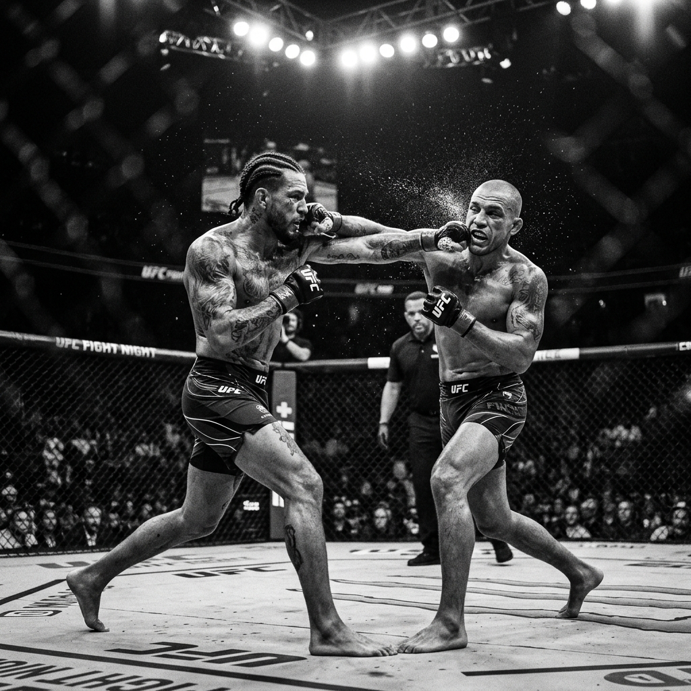

지난 5월 9일 뉴저지 푸르덴셜 센터에서 열린 **UFC 328 메인이벤트**는 격투 팬들의 예상을 뒤엎는 극적인 승부였습니다. 션 스트릭랜드(Sean Strickland)가 캄잣 치마에프(Khamzat Chimaev)를 상대로 스플릿 판정승(48-47, 47-48, 48-47)을 거두며 미들급 챔피언 벨트를 탈환했습니다.

대다수의 전문가들이 치마에프의 압도적인 레슬링과 서브미션 승리를 점쳤으나, 경기의 흐름은 철저하게 **'체력전과 잽의 마스터클래스'**로 흘러갔습니다.

### 1-2라운드: 폭풍을 견뎌낸 필리쉘 가드

경기가 시작되자마자 치마에프는 예상대로 엄청난 폭발력으로 테이크다운을 시도했습니다. 스트릭랜드는 초반 라운드에서 하위 포지션에 깔리며 위기를 맞았지만, 특유의 침착함을 잃지 않았습니다. 

치마에프의 무자비한 파운딩을 방어하기 위해 스트릭랜드는 철저한 필리쉘(Philly Shell) 기반의 방어와 함께 체력을 아끼는 데 집중했습니다. 2라운드 후반부터 치마에프의 호흡이 거칠어지기 시작하는 것이 보였습니다.

> "스트릭랜드의 진정한 무기는 맷집이 아니라, 어떤 상황에서도 당황하지 않는 차가운 멘탈입니다."

### 3-5라운드: 끝없는 잽, 그리고 역전의 서막

3라운드부터 경기의 양상이 완전히 뒤집혔습니다. 체력이 방전된 치마에프를 상대로 스트릭랜드는 특유의 꼿꼿한 스탠스로 전진하며 끊임없이 앞손 잽을 찔러넣었습니다.

테이크다운 위협이 사라진 치마에프는 스트릭랜드의 1-2 스트레이트 콤비네이션에 속수무책으로 안면을 내어주었습니다. 4라운드와 5라운드는 온전히 스트릭랜드의 타격 교보재를 보는 듯했습니다. 화려한 킥이나 큰 펀치 없이, 오직 잽과 원투만으로 상대를 잠식해 나갔습니다.

### 총평

이번 경기는 MMA에서 **'페이스 조절(Pacing)'과 '기본기'**가 얼마나 중요한지 다시 한번 일깨워준 명승부였습니다. 무패의 괴물 같았던 치마에프의 약점(5라운드 체력)이 명백히 드러난 경기였으며, 스트릭랜드는 자신이 왜 챔피언의 자격이 있는지 전 세계에 증명했습니다. 

미들급 전선은 스트릭랜드의 왕좌 탈환으로 인해 또다시 한 치 앞을 알 수 없는 혼돈 속으로 빠져들었습니다.
