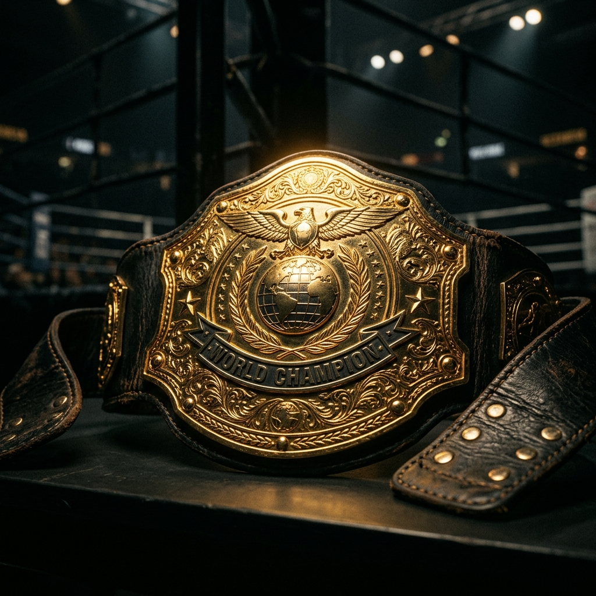

UFC 라이트급은 언제나 **'상어 탱크'** 로 불립니다. 절대 강자가 군림하다가도 한순간의 실수로 벨트의 주인이 바뀌는 마성의 체급입니다.

현재 라이트급 탑 5 컨텐더들의 양상은 그 어느 때보다 흥미롭습니다. 강력한 레슬링을 앞세운 다게스탄 군단과, 이에 맞서는 웰라운더 타격가들의 대결 구도가 심화되고 있습니다.

1. **강력한 레슬링 압박**: 상대를 철망으로 몰아넣고 체력을 갉아먹는 체인 레슬링.
2. **카운터 스트라이킹**: 무리한 테이크다운을 노리는 상대의 빈틈을 노리는 정교한 타격.
3. **무한한 카디오**: 5라운드 내내 지치지 않는 체력전.

결국 다음 챔피언은 *'누가 자신의 영역으로 상대를 더 완벽하게 끌어들이느냐'* 에 달려있습니다.
