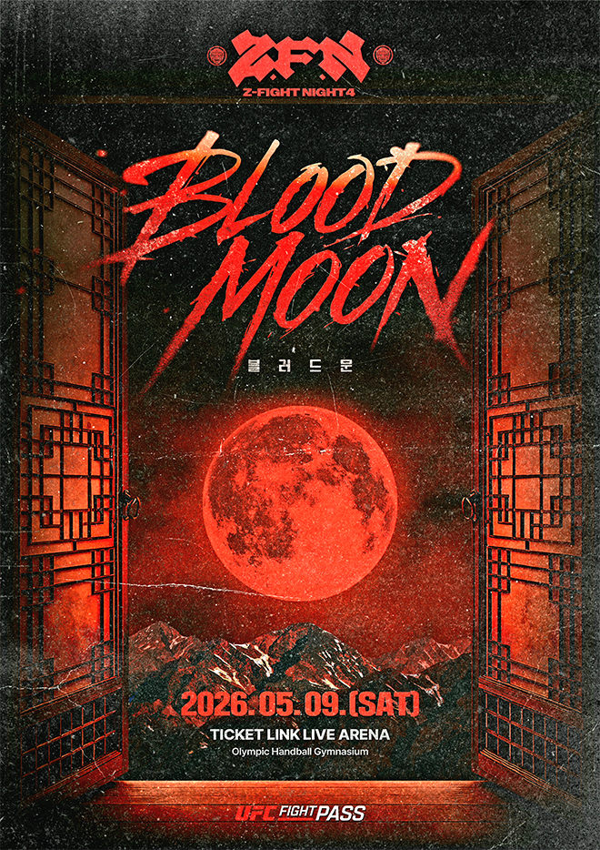

2026년 5월 9일 서울 **티켓링크 라이브 아레나**에서 열린 **ZFN 04: Blood Moon**은 결과만 놓고 읽기엔 아까운 대회였다. 메인 이벤트에서 **황인수**는 알렉스 폴리지를 3라운드 2분 2초 TKO로 잡았고, 코메인에서는 6년 만에 복귀한 **배명호**가 **김한슬**을 상대로 1라운드 1분 20초 닥터스톱 승리를 거뒀다. **최준서**는 전 UFC 파이터 **조쉬 퀸란**을 만장일치 판정으로 넘었다. 이름만 보면 “국내 대회에 괜찮은 카드가 모였다” 정도로 보일 수 있다. 하지만 실제로 이 대회가 남긴 건 그보다 훨씬 컸다.

> "흥행은 하루로 끝나지만, 기준을 바꾼 이벤트는 그 뒤의 카드들까지 바꿔 놓는다."

ZFN 04는 **좋은 경기 몇 개가 나온 밤**이 아니라, 한국 MMA가 앞으로 어떤 모양을 지향할 것인지 한꺼번에 드러낸 밤에 가까웠다. 언더카드는 **ZFN / 코리안좀비MMA 유튜브 채널**, 메인카드는 **UFC Fight Pass**로 분리 송출됐고, 공식 채널은 여기에 **알렉산더 볼카노프스키 방한**까지 적극적으로 얹었다. <mark>이 대회의 진짜 의미는 승자 명단이 아니라, 한국 로컬 이벤트가 어디까지 올라가려 하는지 더 이상 숨기지 않았다는 점이다.</mark>

이 밤이 이후 어떤 서사로 번졌는지 보려면, [배명호의 추성훈 콜아웃 분석](../bae-myung-ho-choo-sung-hoon-zfn04-callout-analysis/index.md)과 [ZFN-블랙컴뱃 갈등 구조 해부](../zfn-vs-blackcombat-discord-analysis/index.md)를 이어서 보는 편이 좋다.

### 1. 황인수의 승리는 컸지만, 기대를 완전히 채운 밤은 아니었다

이번 대회의 얼굴은 결국 **황인수**였다. 그는 메인 이벤트에서 알렉스 폴리지를 잡아냈지만, 이 승리를 단순히 “국내 강타자가 해외 경력자를 눕혔다” 정도로 정리하면 핵심을 놓친다. 더 중요했던 건 **황인수가 압박과 그래플링 위협을 견딘 뒤 다시 자기 타격으로 경기를 되찾았다는 점**이다. 다만 그와 동시에, 이 경기가 황인수를 둘러싼 모든 의문을 시원하게 지워낸 밤이라고 말하기도 어렵다.

그런데 이 경기를 제대로 읽으려면 먼저 상대를 정확히 봐야 한다. **알렉스 폴리지**는 **노스웨스턴 대학교 NCAA Division I 레슬러 출신**으로, MMA로 전향한 뒤 **LFA 라이트헤비급 챔피언십**을 차지한 선수다. 이후 **벨라토르**에서 4승 3패를 기록하며 **요엘 로메로**, **칼 무어** 같은 톱 파이터와 맞붙었고, **PFL**에서도 활동했다. 이력서만 보면 한국 로컬 무대에서 쉽게 소화할 수 있는 유형이 아니다. 하지만 이력서의 뒷장을 넘기면 이야기가 달라진다. <u>폴리지는 ZFN 04에 오기 전 최근 6경기에서 5패를 기록하며 뚜렷한 하락세를 타고 있었다.</u> 벨라토르와 PFL에서 연이어 패하고, 지역 대회에서도 판정패를 당하며 전성기와는 거리가 먼 선수가 되어 있었다. 쉽게 말해, "이름값은 있지만 지금은 지고 있는 선수"였다.

더 중요한 건 스타일이다. 폴리지의 뿌리는 **대학 레슬링**이다. NCAA D1에서 3차례 전국대회에 출전한 정통 레슬러 출신으로, MMA에서도 **테이크다운, 클린치 압박, 더티복싱, 탑 컨트롤로 이어지는 그래플링 기반 게임 플랜**을 주무기로 삼는다. 현역 시절에는 **션 스트릭랜드의 트레이닝 파트너**로도 알려졌는데, 스트릭랜드에게 레슬링을 가르치고 본인은 타격을 배우는 관계였다. 순수한 그라운드 전문가라기보다 레슬링과 압박을 무기로 상대의 리듬을 끊는 유형에 가깝다. 그런데 바로 이 점이 매치메이킹 논란의 핵심이었다.

> **"연패 중인 그래플러를 폭발적인 타격가에게 붙였다. 이건 떡밥 아닌가?"**

한국 MMA 커뮤니티와 유튜브 분석 채널에서는 이 대진이 발표되자마자 비슷한 말이 쏟아졌다. 논리는 단순했다. 폴리지는 연패 중이고, 그래플링 위주 파이터인데, 황인수는 타격으로 먹고사는 선수다. 이런 조합이면 황인수가 스탠딩에서 충분히 압도할 수 있고, 설령 테이크다운을 당하더라도 폴리지의 피니시 능력이 전성기만 못하니 살아남을 가능성이 높다. 즉, **리스크는 낮추고 네임밸류는 챙기는 전형적인 "보호 매치메이킹"**이라는 시각이었다.

- **떡밥 논란의 근거**: 하락세가 뚜렷한 해외 경력자에게 "전 LFA 챔피언, 벨라토르·PFL 경험자" 타이틀을 붙여 이력서용 승리를 설계했다는 비판.
- **반론**: 폴리지의 그래플링은 황인수의 가장 큰 약점을 찌르는 스타일이라 실질적인 시험대이기도 했다.
- **핵심 문제**: 떡밥이든 아니든, 결과로 의심을 잠재우면 되는 건데 — 황인수는 그러지 못했다.

<mark>이 매치메이킹이 논란이 된 진짜 이유는 상대가 약해서가 아니라, 이렇게까지 유리한 조건에서도 황인수가 깔끔한 선언문을 써내지 못했기 때문이다.</mark>

실제 경기 내용이 그 비판에 불을 더 붙였다. 초반에 폴리지가 테이크다운을 시도하고 클린치로 압박하자 황인수는 눈에 띄게 흔들렸다. 케이지에 등이 붙는 장면, 그래플링 교환에서 불안정한 밸런스, 상대의 더티복싱에 리듬을 잃는 순간들이 반복됐다. 결국 황인수는 스탠딩으로 돌아오는 데 성공했고, 카프킥과 펀치의 누적으로 3라운드 TKO를 만들어냈다. 하지만 **연패 중인 상대에게 2라운드 넘게 고전한 뒤에야 겨우 마무리한 경기**라는 인상은 쉽게 지워지지 않았다.

- **1라운드**: 폴리지의 클린치와 테이크다운 시도에 밀렸다. 황인수의 타격이 거의 살지 못한 라운드.
- **2라운드**: 스탠딩 회복은 됐지만 압도적이지 않았다. 카프킥이 쌓이기 시작했으나 확실한 지배로 이어지진 못했다.
- **3라운드**: 누적된 타격과 압박이 마침내 결실을 맺으며 TKO로 마무리했다.

<mark>황인수의 ZFN 04는 분명 반등이었지만, 면죄부까지는 아니었다.</mark>

### 2. 최준서는 가장 비싼 종류의 승리를 챙겼다

이날 가장 인상적인 승리를 한 선수를 하나만 꼽으라면, 오히려 나는 **최준서**를 먼저 이야기하고 싶다. 전 UFC 파이터 **조쉬 퀸란**을 상대로 거둔 만장일치 판정승은 겉으로는 조용하지만, 안을 열어 보면 매우 값비싼 결과였다.

이 승리의 값이 커진 건 경기 내용만 때문이 아니었다. **최준서는 블랙컴뱃 초대 웰터급 챔피언이라는 이력 자체를 끌고 ZFN으로 넘어온 선수**다. 코리안좀비MMA 합류 이후에는 방어전, 계약, 타이틀 처리 문제를 둘러싼 잡음이 이어졌고, ZFN 04 현장 리포트에서도 “이적 후 계약 문제를 겪은 선수”라는 설명이 따라붙었다. 그래서 이번 승리는 단순한 1승이 아니라, <u>이적의 정당성을 실력으로 입증해야 하는 밤</u>이기도 했다.

초반 흐름만 보면 최준서가 편한 경기를 한 것은 아니었다. 퀸란의 리치와 볼륨이 부담이 됐고, 경기 중 반칙성 니킥이라는 변수도 있었다. 그런데 최준서는 감정적으로 무너지지 않았다. 라운드가 갈수록 거리 감각을 읽었고, 카운터 타이밍을 맞췄고, 3라운드에는 다운까지 만들었다. 이건 단순히 근성이 좋다는 말로 설명되는 승리가 아니다. **상대가 보여주는 정보를 라운드 안에서 해석하고, 그 해석을 경기 결과로 바꾸는 능력**이 있어야 가능한 승리다.

> **최준서는 이긴 것이 아니라, 읽어서 뒤집었다. 그래서 이 승리가 더 오래 남는다.**

- **1라운드**: 퀸란의 길이와 리듬이 앞섰다.
- **2라운드**: 최준서가 타이밍과 진입 각도를 읽기 시작했다.
- **3라운드**: 다운까지 만들며 흐름을 완전히 자기 쪽으로 가져왔다.

한국 선수들이 해외 경력자와 만났을 때 자주 보이는 실패 패턴은 둘 중 하나다. 초반 기세에 눌리거나, 반대로 지나치게 감정적으로 응수하다가 자기 리듬을 잃는 것이다. 최준서는 그 두 함정을 모두 피했다. <mark>이 승리가 중요한 이유는 최준서가 강해서가 아니라, 더 높은 레벨의 경험을 가진 상대를 상대로도 전술적으로 조정할 수 있다는 점을 증명했기 때문이다.</mark>

그건 선수 개인의 성과를 넘어서는 의미를 갖는다. 국내 단체 챔피언급 선수들이 국제 무대 경험자와 붙었을 때도, 이제는 단순 투지나 체력으로만 버티는 것이 아니라 경기 해석으로 이길 수 있다는 가능성이 보였기 때문이다.

여기에 이적 이슈의 무게를 얹어 보면 의미는 더 커진다. 블랙컴뱃에서 이름을 키운 선수가 정찬성의 체육관과 ZFN 무대로 옮겨 와 첫 굵직한 시험대에서 이겼다는 건, 결국 **선수 커리어의 다음 단계가 어디에서 열리는가**라는 질문에도 영향을 준다. 국내 MMA가 이제는 단체 간 라이벌리만이 아니라, 누가 어떤 선수의 다음 장을 설계하느냐까지 경쟁하는 국면에 들어섰다는 뜻이다.

### 3. 배명호의 복귀전은 향수보다 기술 자산을 증명했다

코메인 이벤트는 서사가 강했다. 2026년 5월 9일 기준 **39세**, 곧 마흔을 앞둔 **배명호**가 6년 만에 돌아왔고, 상대는 한 시대를 대표한 타격가 **김한슬**이었다. 마지막 공식전이 2020년 ONE Championship 무대였다는 점을 감안하면, 이번 복귀는 단순한 “레전드 재등장”이 아니라 한국 MMA 팬들이 거의 잊어갈 즈음 다시 꺼내 든 오래된 이름의 귀환에 가까웠다.

배명호의 복귀가 더 흥미로웠던 건 이 시간이 완전히 사라져 있던 공백이 아니었다는 점이다. 그는 팀매드와 유튜브 콘텐츠를 통해 꾸준히 존재감을 드러냈고, 팬들은 그가 다시 몸을 만들고 컨디션을 끌어올리는 과정을 부분적으로라도 지켜봤다. <ins>즉, 이번 복귀전은 갑자기 나타난 이벤트가 아니라 “아직 끝나지 않았다”는 신호를 오래 끌어온 끝에 찍힌 본편</ins>에 가까웠다.

하지만 이 경기를 감성으로만 소비하면 오히려 핵심을 놓친다. 짧은 경기였어도 분명히 드러난 것이 있었다. 배명호는 여전히 **첫 시도가 막히면 곧바로 두 번째 선택으로 넘어가는 레슬링 연결 감각**을 가지고 있었다.

싱글렉에서 즉시 끝내지 못한 뒤 상대 밸런스를 무너뜨리고, 슬램성 테이크다운으로 연결하는 흐름은 우연이 아니다. 오래 쉬었다고 해서 그런 장면이 나오지 않는다. 몸이 기억하고, 상황을 읽고, 연결이 살아 있어야 나온다. 김한슬의 부상으로 경기가 예상보다 빨리 끝났기 때문에 더 긴 평가는 유보할 수밖에 없지만, 적어도 한 가지는 선명했다.

- **배명호가 증명한 것**: 베테랑의 기술은 공백만으로 사라지지 않는다.
- **김한슬에게 남은 과제**: 그래플링 압박 대응과 첫 방어 이후의 두 번째 선택.
- **경기의 상징성**: 한국 MMA가 새 얼굴만으로 굴러가는 생태계가 아니라는 사실.

<ins>배명호의 승리는 복귀 서사의 성공이라기보다, 한국 MMA 안에 여전히 회수 가능한 기술 자산이 남아 있다는 신호처럼 읽혔다.</ins>

이 점은 꽤 중요하다. 한국 MMA는 늘 “다음 세대”를 말하지만, 동시에 과거 세대가 쌓아놓은 기술적 문법을 얼마나 잘 연결하고 있는가에 대해서는 자주 소홀했다. ZFN 04는 그 단절을 조금 메우는 카드처럼 보였다. 무엇보다 배명호의 복귀는 단순 향수 마케팅이 아니라, **나이와 공백, 방송과 사업, 그리고 다시 몸을 만들어 케이지로 돌아오는 집요함까지 하나의 서사로 묶인 복귀전**이었다. 그래서 팬들에게는 결과보다 “배명호가 다시 여기까지 왔다”는 사실 자체가 먼저 보였다.

#### 배명호는 경기 밖에서도 다음 장면을 예고했다

배명호의 복귀전이 더 오래 남는 이유는, 그가 승리만 남기고 내려간 밤이 아니었기 때문이다. 경기 뒤 짧게 **추성훈**의 이름을 꺼내며 다음 서사를 예고했고, 그 한 장면만으로도 팬들은 곧바로 “이 복귀가 여기서 끝나는가”라는 질문을 붙이기 시작했다.

다만 이 글에서 그 장면을 길게 붙들 필요는 없다. ZFN 04의 핵심은 특정 슈퍼파이트 성사 여부보다, **배명호가 복귀전 자체를 결과와 화제성 두 축으로 모두 성공시켰다는 점**에 있다. <mark>즉, 추성훈 언급은 이 밤의 본론이라기보다 배명호가 자기 복귀를 한 경기짜리 이벤트로 끝내지 않겠다고 선언한 짧고 강한 예고편에 가까웠다.</mark>

### 4. ZFN 04의 완성도는 메인이 아니라 카드 전체에서 드러났다

좋은 대회는 메인 하나로 설명되지 않는다. 메인이 강하고, 코메인이 의미를 받쳐주고, 중간 카드가 미래를 담고, 전체 서사가 한 방향으로 움직여야 한다. ZFN 04는 국내 대회 기준으로 드물게 **카드 전체가 한 덩어리처럼 보인 이벤트**였다.

공개된 카드 구성을 보면 **UFC 경험자**, **Contender Series 경력자**, **Road to UFC 출신**, **해외 단체 챔피언**, **국내 단체 챔피언**이 한 장 안에서 섞여 있었다. 더 흥미로운 건 플랫폼 설계였다. 언더카드는 자체 유튜브로 팬덤 접점을 넓히고, 메인카드는 **UFC Fight Pass**로 글로벌 송출했다. 이 구조는 “로컬이지만 국제 기준으로 보이고 싶다”는 의도를 꽤 노골적으로 드러낸다.

- **대진의 장점**: 단순히 유명한 선수를 모은 것이 아니라, 서로의 가치가 맞물리는 카드였다.
- **브랜딩의 장점**: 국내 관객만이 아니라 해외 팬에게도 설명 가능한 패키지였다.
- **연출의 장점**: 이벤트 전체가 하나의 큰 밤처럼 보이도록 구성됐다.
- **플랫폼의 장점**: 유튜브 접근성과 Fight Pass의 글로벌 상징성을 한 카드 안에 동시에 올렸다.

> "ZFN 04의 완성도는 화려함보다 설계에서 나왔다. 그래서 더 위험했고, 그래서 더 인상적이었다."

물론 흠이 없었다고 말하는 건 과장이다. 일부 매치는 호기심이 앞선 감이 있었고, 국내 대회 특유의 과잉 연출 욕심도 비쳤다. 하지만 그런 결함마저도 이 이벤트가 작게 보이는 것을 거부하고 있었다는 증거로 읽힌다. 차라리 이런 야심이 있는 편이, 안전하고 무난한 카드보다 훨씬 낫다.

### 5. 이 대회가 국내 MMA 단체들에 남긴 건 분명한 압박이다

ZFN 04 이후 국내 단체들이 마주할 가장 불편한 질문은 간단하다. **이제는 그냥 대회를 여는 것만으로 존재 이유가 설명되는가.** 아마 아닐 가능성이 높다.

한국 MMA는 그동안 선수층은 넓어졌지만, 이벤트 문법은 상대적으로 보수적이었다. 로컬 스타 몇 명, 유망주 몇 명, 메인 하나, 그리고 익숙한 홍보 방식. 그런데 ZFN 04는 그 익숙함을 한 단계 밀어 올렸다. 해외 경력자와의 교차 대진, 글로벌 송출, 팬들이 이해할 수 있는 서사 구조, 그리고 “이 카드엔 이유가 있다”는 인상을 동시에 만들었다.

여기서 더 중요한 건 **국내 단체의 진화 방향이 하나로 수렴하지 않는다는 점**이다. 최근 한국 MMA를 둘러싼 논의에서는 종종 **블랙컴뱃**이 보여주는 유튜브 기반 콘텐츠 플랫폼형 모델과, **ZFN**이 밀고 있는 엘리트 파이프라인형 모델이 대비된다. 전자가 캐릭터와 서사를 전면에 내세워 폭발적인 팬덤을 만든다면, 후자는 국제 무대와의 연결, 선수 검증, 카드의 격을 더 강하게 의식한다. ZFN 04는 후자의 방향을 가장 선명하게 보여준 사례였다.

이번 대회가 다른 단체들에 남긴 숙제는 꽤 뚜렷하다.

1. **매치메이킹의 질**
국내 선수끼리만 반복해서 돌리는 카드로는 더 이상 강한 화제를 만들기 어렵다.
2. **브랜드의 논리**
왜 이 단체를 봐야 하는지, 왜 이 대회가 특별한지 설명할 수 있어야 한다.
3. **플랫폼의 격**
어디서 중계되느냐가 단체 위상에 직접 연결되는 시대가 됐다.
4. **선수 육성 방식**
몇 연승이 아니라, 어떤 상성과 어떤 레벨을 상대하며 성장했는지가 더 중요해질 수 있다.

<mark>ZFN 04가 남긴 가장 큰 압박은 “우리도 이런 대회를 할 수 있다”가 아니라, “이 정도는 해야 이제 비교에서 밀리지 않는다”는 현실이다.</mark>

이건 누군가를 곧바로 패자로 만든다는 뜻은 아니다. 오히려 반대로, 한국 MMA가 **콘텐츠 플랫폼형 흥행**과 **엘리트 검증형 이벤트**라는 두 방향으로 더 분화할 가능성이 있다는 뜻에 가깝다. 다만 어느 길을 택하든, 앞으로 큰 카드를 발표하는 단체들은 팬들로부터 무의식적인 비교를 피할 수 없게 된다. 메인 이벤트의 무게, 해외 연결성, 카드의 논리, 현장 연출, 그리고 플랫폼 전략까지 포함해서 말이다.

### 6. 정찬성의 영향력은 이제 선수의 영역을 넘어섰다

이 글에서 **정찬성**을 뒤로 미루는 건 불가능하다. 한국 MMA에서 정찬성은 이미 선수로서 역사적 위치를 확보했다. 그런데 ZFN 04가 흥미로운 건, 그의 이름이 더 이상 단순한 향수나 스타성으로만 작동하지 않는다는 점이다. 지금의 정찬성은 **신뢰를 모으고, 연결을 만들고, 이벤트를 한 단계 높여 보이게 만드는 브랜드**로 움직인다.

동시에 그 브랜드는 이미 여러 차례 마찰도 낳아 왔다. 체육관과 단체 운영을 병행하는 과정에서 **다른 단체가 키운 선수를 결국 자기 판으로 데려오는 것 아니냐는 시선**, 체육관과 주변 인물들이 전면에 노출되는 과정에서 생긴 **아내 관련 잡음**, 황인수처럼 실력은 크지만 논란도 큰 선수를 품는 결정, 그리고 “정찬성의 코칭이 과연 어디까지 실제 경기력으로 번역되느냐”는 질문까지 겹치며 비판이 쌓인 것도 사실이다. 격투기 레전드로서의 명성이 단체 대표라는 새 역할에서 조금씩 닳아 보였던 순간들이 있었다는 뜻이다.

> **그래서 ZFN 04의 성공은 정찬성 브랜드의 확장이면서 동시에, 최근 몇 달간 갉아먹히던 신뢰를 다시 복구한 밤이기도 했다.**

볼카노프스키의 방한, UFC Fight Pass 송출, 국내외 경력자가 섞인 카드, 팬들이 “한번 봐야 한다”고 느끼게 만드는 흡입력은 우연히 병치된 것이 아니다. 그 뒤에는 “정찬성이 만든 판이라면 최소한 한 번은 볼 가치가 있다”는 신뢰가 있다. 특히 공식 채널이 **유튜브로 팬덤 접점을 유지하면서도**, 메인 무대는 Fight Pass로 올려놓는 방식은 정찬성 브랜드가 로컬 팬심과 국제 지향성을 동시에 붙잡으려 한다는 걸 보여준다. 한국 격투기에서 이 정도의 상징 자본과 인적 네트워크를 동시에 가진 인물은 사실상 드물다.

- **첫 번째 영향력**: 해외와 연결되는 신뢰를 만든다.
- **두 번째 영향력**: 국내 팬에게 관전의 이유를 제공한다.
- **세 번째 영향력**: 선수에게 ZFN 출전 자체가 이력의 한 줄이 되게 만든다.

<u>정찬성의 힘은 유명세가 아니라, 유명세를 산업적 구조로 번역하고 있다는 데 있다.</u>

이건 생각보다 큰 차이다. 한국 격투기에서는 종종 유명인이 단체를 만들었다는 뉴스가 크게 소비된다. 하지만 첫 화제성 이후 유지가 안 되는 경우도 많다. ZFN 04는 적어도 이번만큼은 그 함정을 비껴갔다. 이름값으로 시선을 모으고, 실제 카드와 결과로 그 기대를 어느 정도 충족했기 때문이다. 더 정확히 말하면, **정찬성은 최근 자신을 따라붙던 운영 논란을 이 밤 한 번으로 완전히 지운 것은 아니지만, 적어도 “그래도 결국 판은 만든다”는 반론을 가장 강하게 제시했다.**

### 7. 결론: ZFN 04는 결과표보다 높은 기준을 남겼다

정리하면 ZFN 04는 세 가지를 동시에 해냈다. 첫째, **황인수**, **최준서**, **배명호**라는 각기 다른 위치의 선수들이 각각 다른 방식으로 의미 있는 결과를 냈다. 둘째, 이벤트 전체가 국내 대회치고는 드물게 높은 밀도의 설계와 **플랫폼 분업 구조**를 보여줬다. 셋째, 정찬성이라는 이름이 단순한 스타 소비를 넘어 실제 산업적 동력으로 작동할 수 있다는 점을 증명했다.

그렇다고 이 대회 하나로 한국 MMA의 미래가 갑자기 열렸다고 말할 수는 없다. 냉정하게 말하면 아직은 한 번의 강한 이벤트일 뿐이다. 진짜 평가는 반복성에서 나온다. ZFN이 이 정도 수준의 카드를 계속 유지할 수 있는지, 다른 단체들이 어떻게 응답할지, 여기서 모멘텀을 얻은 선수들이 더 큰 무대로 실제로 연결되는지가 다음 질문이다.

하지만 그 유보를 감안하더라도, 한 가지는 분명하다.

> <mark>ZFN 04는 잘 만든 로컬 대회가 아니라, 한국 MMA가 어떤 방향으로 고도화될 수 있는지 한 가지 선명한 해답을 제시한 이벤트로 기억될 가능성이 크다.</mark>

그래서 이 대회를 가장 정확히 설명하는 문장은 아마 이쯤일 것이다. ZFN 04는 단순히 성공한 밤이 아니었다. 한국 MMA가 이제 어떤 얼굴로 외부와 만나고 싶은지, 그리고 국내 안에서는 어떤 다른 모델들과 경쟁하게 될지를 동시에 보여준 밤이었다. 그리고 그 욕망의 가장 앞줄에는 여전히 **정찬성**이라는 이름이 서 있었다.

