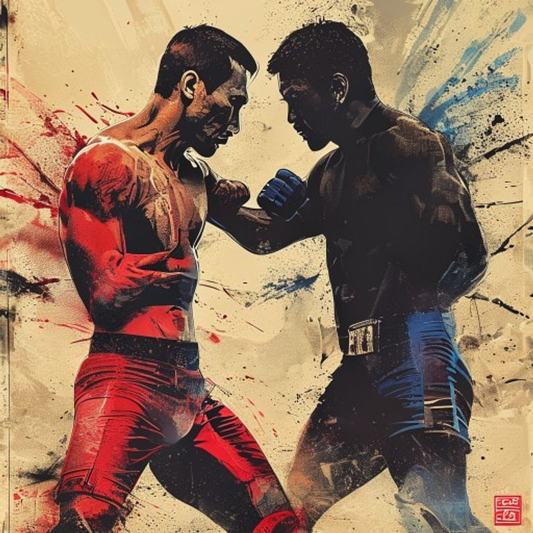
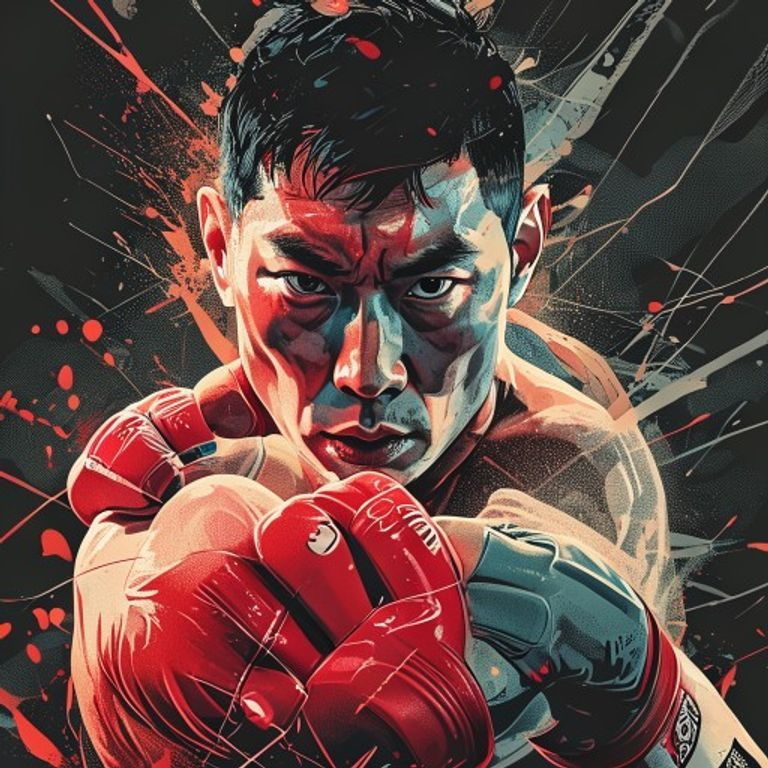
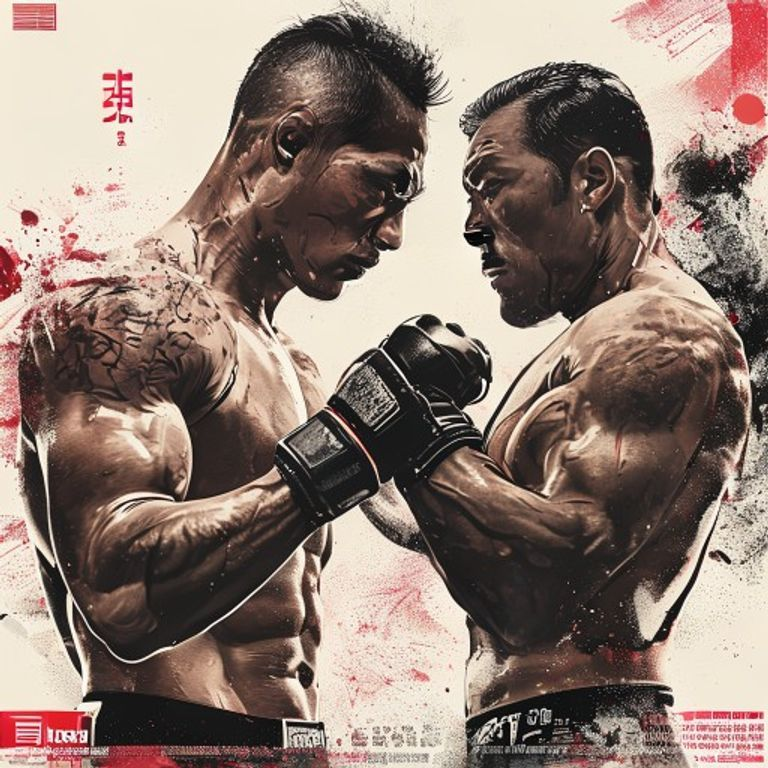

대한민국 종합격투기(MMA) 역사상 지금처럼 단체 간의 **상호 작용**과 **보이지 않는 긴장감**이 팽배했던 적은 없다. 과거 로드FC의 독주 체제 하에 고착화되어 있던 로컬 씬은 이제 완전히 해체되었고, 그 공백 위에 두 개의 거대한 축이 솟구쳐 올랐다. '코리안 좀비' **정찬성**이 이끄는 **ZFN (Z-Fight Night)**과 뉴미디어 비즈니스의 천재 '검정' **박평규**가 설계한 **블랙컴뱃 (BLACK COMBAT)**이다.

최근 이 두 단체 사이의 기류는 예사롭지 않다. 단순한 흥행 경쟁을 넘어선 감정적 마찰, 선수들의 이적을 둘러싼 규칙과 법리의 충돌, 그리고 무엇보다 "어떤 격투기가 진짜 격투기인가"라는 본질적 철학의 충돌까지 겹쳤다. 팬들은 이를 '불협화음'이라 부르며 흥미진진하게 대립을 관전하지만, 업계의 시선은 한층 무겁다. <mark>이 불협화음은 일시적인 가십이 아니라, 대한민국 MMA 생태계가 정통 엘리트 스포츠와 뉴미디어 예능 쇼맨십이라는 두 갈래 진화 경로 사이에서 겪는 진통이기 때문이다.</mark>

> "격투기가 투쟁에서 비즈니스로, 비즈니스에서 문화로 넘어가는 길목에는 언제나 기준을 세우려는 이들의 전쟁이 있었다."

두 개의 궤적이 대한민국 MMA라는 좁은 영토 위에서 충돌하게 된 배경과 원인, 그리고 이것이 한국 격투기 판에 남길 유산을 종합적이고 입체적으로 해부해 본다.

---

### 1. 엘리트 스포츠의 수호자 ZFN vs 서사의 연금술사 블랙컴뱃

두 단체를 올바르게 비교하기 위해서는 이들이 탄생한 토양과 핵심적인 **비즈니스 모델(BM)**을 깊이 이해해야 한다. 둘은 격투기 대회를 개최한다는 겉모습만 공유할 뿐, 선수 육성, 경기 연출, 수익화 모델 등 거의 모든 작동 원리가 완벽하게 반대에 서 있다.

먼저 **ZFN**의 본질은 **'UFC로 통하는 공식 파이프라인'**이다. 정찬성 대표의 강력한 글로벌 네트워크와 상징 자본을 바탕으로 설립된 이 단체는 철저히 **스포츠적 완성도**에 목을 맨다. 대회가 **UFC 파이트 패스(UFC Fight Pass)**를 통해 전 세계로 송출된다는 사실은 ZFN의 정체성을 단적으로 말해준다. ZFN에 서는 선수들은 스토리를 팔지 않아도 된다. 오직 케이지 안에서 완벽한 **레벨 체인지**와 정밀한 **체크훅**, 견고한 **카프킥** 공방을 통해 본인의 경기력을 증명하면 된다. ZFN이 지향하는 최종 목표는 **실력 검증을 거친 국내 파이터를 해외 메이저 단체로 수출하는 엘리트 육성 플랫폼**이다. 다만 이 엄격한 스포츠 지향은 스토리 서사 없는 대진에서 대중적 화제성을 끌어내기 어렵고, 높은 제작비 대비 단기 수익 모델이 불투명하다는 구조적 한계를 동시에 안고 있다.

반면 **블랙컴뱃**은 **'격투 극장(MMA Drama)'**에 가깝다. 이들은 유튜브라는 강력한 미디어를 메인 플랫폼으로 삼고, 선수의 전적이나 백그라운드보다 **서사(Storytelling)**와 **캐릭터(Character)**를 전면에 내세운다. 블랙컴뱃의 대진은 단순한 랭킹 순이 아니다. 유튜브 콘텐츠 속에서 빚어낸 원한 관계, 도발, 극적인 갈등 구조가 링 위에서 해소되는 형태로 대회가 연출된다. 격투기를 한 번도 보지 않던 일반 대중들을 유튜브 조회수를 통해 격투 씬으로 끌어들인 공적은 블랙컴뱃이 독보적이다. 그러나 정통 격투 팬들로부터 제기되는 '예능적 연출'과 '경기력 불균형' 비판, 그리고 엘리트 파이터 수급의 한계는 블랙컴뱃이 풀어야 할 숙제로 남아 있다.

<u>결국 ZFN은 선수의 무대를 만들어주는 스포츠 프로모터로 움직이고, 블랙컴뱃은 격투를 소재로 삼는 종합 콘텐츠 프로덕션으로 기획되었다.</u> 이 극명한 방향성의 차이가 바로 갈등의 마찰력이 생성되는 본질적 원인이다.

---

### 2. 레전드의 자부심과 기획자의 야심: 정찬성 대 검정

두 단체의 불협화음은 각 단체의 선장인 **정찬성** 대표와 **검정(박평규)** 대표의 살아온 이력과 철학의 온도 차이에서 증폭된다.

**정찬성**은 대한민국 역사상 가장 위대한 UFC 타이틀 도전자이자, 아시아 종합격투기의 살아있는 역사다. 그는 평생을 UFC라는 세계 최고의 엘리트 무대에서 싸우며 **체육관의 과학적인 시스템**, **정교한 매치 휠**, **철저한 선수 보장 제도**의 중요성을 뼈저리게 느낀 인물이다. 따라서 그는 격투기가 자극적인 연출이나 유튜브식 서사에 의존해 '가벼운 구경거리'로 전락하는 현상에 본능적인 거부감을 보인다. 정찬성에게 격투기는 목숨을 걸고 자신을 깎아내는 파이터들의 신성한 스포츠이며, 대회의 위상은 연출이 아닌 선수의 **체급별 랭킹**과 **국제적 수준**으로 결정되어야 한다.

#### [비하인드 스토리] 좀비트립의 대중성을 버리고 정통 스포츠를 택한 이유: 정찬성의 ZFN 빌드업

정찬성이 은퇴 후 곧바로 ZFN이라는 '엘리트 스포츠 단체'를 세운 데에는 그만의 치밀한 계산과 뼈아픈 경험이 녹아 있다.

- **UFC 타이틀전이 남긴 자각**: 정찬성은 두 차례의 UFC 페더급 타이틀 도전(vs 조제 알도, vs 알렉산더 볼카노프스키)을 통해 세계 최정상의 무대가 요구하는 체급 관리, 과학적 훈련 인프라, 국제 수준의 매치메이킹이 한국 로컬 씬에는 전혀 갖춰져 있지 않다는 사실을 절감했다. 한국 선수가 UFC 본 대회까지 도달하려면 국내에서부터 글로벌 스탠다드의 검증을 거칠 수 있는 '중간 플랫폼'이 반드시 필요하다는 것이 그의 결론이었다.
- **'좀비트립'의 폭발적 성공, 그리고 의식적 거리두기**: 은퇴 후 정찬성은 유튜브 채널 **'좀비트립: 파이터를 찾아서'**를 런칭하여 폭발적인 조회수와 화제성을 기록했다. 길거리 싸움꾼들을 실전 기술로 압도하는 콘텐츠는 대중에게 카타르시스를 선사하며 격투기 입문 팬을 대거 유입시켰다. 그러나 정찬성은 이 대중적 성공 경험에도 불구하고 ZFN만큼은 철저히 **정통 스포츠 문법**으로 운영하겠다는 노선을 고수했다. 그는 좀비트립이 대중성의 힘을 증명했지만, 그것이 '선수 커리어를 설계하는 단체의 문법'이 되어서는 안 된다고 판단한 것이다.
- **UFC 파이트 패스 계약과 자기 희생적 결단**: ZFN의 정체성을 가장 명확히 보여주는 결정은 국내 단체 최초이자 유일하게 **UFC 파이트 패스**와 메인카드 중계 계약을 맺은 것이다. 이 계약으로 ZFN 대회의 메인카드는 전 세계 격투기 팬들에게 노출될 기회를 얻었지만, 동시에 정찬성은 가장 수익성이 높은 **자체 유튜브 생중계 권한을 포기**해야 했다. 단기 수익보다 후배 선수들의 글로벌 노출과 커리어 가치를 우선시한 이 결단은 ZFN이 단순 흥행 단체가 아니라 **선수 성장형 엘리트 플랫폼**임을 선언한 상징적 행보였다.
- **데이나 화이트와의 신뢰 자본**: 정찬성이 UFC에서 은퇴할 때 **데이나 화이트** UFC 회장은 직접 영상 메시지를 통해 정찬성과의 신뢰를 공개적으로 확인했다. 이 관계는 ZFN 설립 이후에도 이어져, 볼카노프스키를 비롯한 현역 UFC 톱 파이터들이 ZFN 행사에 참석하고 응원하는 전례 없는 장면이 연출되고 있다. <ins>정찬성이라는 브랜드의 진짜 힘은 유명세가 아니라, 세계 격투기 산업의 핵심 인물들과 맺은 실질적 신뢰 네트워크에서 나온다.</ins>

> "선수가 케이지 위에서 보여주는 경기력보다 더 가치 있는 스토리는 없다. 그것이 진짜 격투기다."

이와 대조적으로 **검정(본명 박평화)**은 종합격투기 선수 출신이 아니다. 그는 대학에서 경영학을 전공하고 영화감독을 꿈꾸며 영상 콘텐츠와 비즈니스 모델 설계를 주도해 온 **뉴미디어 기획자**다. 그는 한국 MMA가 고사하고 있던 이유를 '대중성 부족'과 '파이터들의 캐릭터 부재'에서 찾았다. 아무리 세계적인 기술을 보유해도 대중이 누군지 모르면 시장은 자라지 않는다는 것이 그의 지론이다. 검정에게 격투기는 최고의 몰입감을 선사하는 '서사 비즈니스'이며, 파이터들은 옥타곤이라는 무대 위에서 자신만의 스토리를 연기하는 주인공들이다. 그는 기존 격투기 판의 엄숙주의를 비판하며, 팬들이 열광하고 돈을 지불할 수 있는 판을 짜는 것이 대표의 진짜 역할이라고 믿어 왔다.

#### [비하인드 스토리] 창고방 격투 기획에서 아시아 무대까지: 검정의 블랙컴뱃 빌드업

검정이 대한민국 종합격투기 판에 파란을 일으킬 수 있었던 것은 그가 걸어온 독특한 **'스토리텔링 성장 궤적'** 덕분이다. 

- **창고(Garage) 격투기에서 싹튼 아이디어**: 미국 유학 시절 UFC의 폭발적 성장에 매료된 그는 홈스테이 집 창고를 개조해 지인들과 자체 격투 대회를 기획·중계하는 대담한 시도를 감행했다. 이때의 거칠고 야성적인 현장 무드와 스토리텔링 중심 기획이 훗날 블랙컴뱃의 씨앗이 되었다.
- **'검정'이라는 이름의 무게**: 그의 활동명 **'검정'**은 모든 색을 섞어도 결국 검은색이 되며, 어떤 색 위에도 덧칠해져 자신만의 자국을 남긴다는 뜻을 지닌다. 이는 기존 격투 씬의 낡은 관습을 집어삼키고 자신만의 강렬한 임팩트를 새기겠다는 야심 찬 비즈니스 철학을 투영한 것이다.
- **'무채색필름'의 피봇과 스토리텔링의 탄생**: 영화감독의 꿈을 안고 귀국한 그는 유튜브 채널 **'무채색필름'**을 개설했다. 초기에는 단순한 격투 영상에 그쳐 난조를 겪었으나, **2021년 12월**을 기점으로 단순 경기 스파링이 아닌 '선수들의 인간적 갈등과 날 것 그대로의 원한'을 다큐멘터리 드라마 스타일로 연출하는 대전환을 이루었다. 복싱 국가대표 출신 **신종훈**과 유튜버 간의 스페셜 매치 등을 연이어 대히트시키며 한국 격투계의 시선을 단숨에 낚아챘다.
- **오디션 신화와 스타 파이터의 산실**: 웹 예능 포맷을 차용한 **'블랙컴뱃 오디션'** 시리즈는 블랙컴뱃의 최고 흥행 공신이다. 오디션을 통해 발굴된 **'광남' 신승민**, **'바이퍼' 김성웅**, **'피투' 송민우** 등은 뛰어난 경기력에 독보적인 캐릭터 서사까지 입혀져 기존 메이저 단체 선수들 이상의 전국구 팬덤을 확보했다.
- **국내 최초의 흑자 모델과 전용 경기장 구축**: 스폰서십 구걸에 의존하던 기존 단체들과 달리, 검정은 팬덤 직접 판매 모델(유튜브 멤버십, 경기 당일 PPV 판매, 현장 티켓 조기 매진)을 통해 **투자금 유치 없이 자생적으로 흑자 전환에 성공한 국내 최초의 단체**를 일궈냈다. 이후 인천에 자체 전용 경기장인 **'블랙 아고라(Black Agora)'**를 설립하여 상설 리그(챔피언스리그)와 넘버링 대회의 지속 가능한 기틀을 마련했다.
- **아시아 영토 확장**: 일본 격투기의 전통 있는 명가인 **DEEP**과의 5대5 단체 대항전을 성사시켰고, 원정 경기에서 극적인 승리를 거두며 단순 웹 예능 단체가 아닌 정통 격투 단체로서의 명분과 아시아 시장 경쟁력을 동시에 입증했다.

<u>검정은 격투기를 스포츠의 테두리에만 가두지 않고, 영화적 연출과 미디어 드라마의 문법을 결합하여 자생 가능한 '종합 스포츠 엔터테인먼트'로 진화시킨 유일무이한 기획자다.</u>

- **정찬성 대표의 철학**: 엘리트 스포츠주의, 파이터 존중, UFC 수준의 완성도와 규칙성.
- **검정 대표의 철학**: 대중 엔터테인먼트 비즈니스, 주도적 서사 설계, 시장의 파이 확장을 위한 연출의 대담성.

<mark>두 대표의 차이는 단순한 성향 차이를 넘어, 대한민국 MMA 씬을 정의하는 문법의 주도권 싸움이다.</mark> 정찬성은 검정의 방식을 격투기의 품격을 낮추는 가벼운 예능이라 간접적으로 우려하고, 검정은 정찬성의 방식을 대중과 격리된 채 낡은 규칙 속에 갇혀 있는 엘리트주의라 생각한다. 이 평행선은 서로가 가진 자부심과 야심이 맞닿아 있어 결코 좁혀지기 힘든 성질의 것이다.

---

### 3. 갈등의 도화선: 최준서 템퍼링 논란과 계약 윤리의 명암

이들의 이념적 대립이 실질적인 법적·도덕적 분쟁으로 폭발한 사건이 바로 **최준서** 선수의 **템퍼링(Tempering, 사전 접촉) 논란**이다.

최준서는 블랙컴뱃이 직접 발굴하고 성장시킨 **초대 웰터급 챔피언**이자, 단체의 상징적인 프랜차이즈 스타였다. 그러나 그가 자신의 훈련 베이스를 정찬성의 **코리안좀비MMA**로 옮기고, 급기야 ZFN으로 이적하는 과정에서 양 단체는 깊은 상처를 입었다. 갈등의 트리거는 인스타그램에 올라온 식사 사진 한 장이었다. 정찬성 대표의 배우자가 정찬성, 최준서, 그리고 황인수가 함께 찍은 사진을 게재하며 **"든든하다"**는 문구를 남긴 것이다. 블랙컴뱃의 계약 기간이 엄연히 남아있던 시점에서의 이 사진은 블랙컴뱃 구단주들과 팬덤에게 커다란 배신감과 도발로 다가왔다.

이 사건을 기점으로 수면 밑에 있던 두 단체의 룰 미팅과 계약 윤리에 대한 해석 차이가 전면에 드러났다.

- **블랙컴뱃의 입장**: 최준서와의 계약 연장(2년 옵션) 조항을 정리하던 과도기에, 타 단체 대표(정찬성)가 개입하여 선수의 잔류를 흔들었다. 이는 이적 시장의 규칙을 깨뜨리는 명백한 템퍼링이며 대기업의 중소기업 선수 빼가기와 다름없다.
- **정찬성 대표 및 최준서 측 입장**: 선수의 커리어 선택권은 헌법상 직업 선택의 자유에 속한다. 기존 계약서의 허점이나 독소 조항(은퇴 후 활동 제한 등)에 대해 선수가 도움을 청했을 때 조언을 해준 것일 뿐이며, 법적 하자가 없는 이적이다.

<u>최준서 논란은 단순히 한 파이터의 이적 해프닝이 아니라, 한국 MMA 로컬 단체들이 겪고 있는 미성숙한 계약 구조의 민낯을 드러냈다.</u> 블랙컴뱃은 선수를 키우고 브랜딩하는 비용을 투자했기에 그 보상을 보장받아야 한다고 주장했고, 정찬성 측은 파이터들이 불공정한 장기 계약이나 독소 조항에 묶여 커리어의 골든 타임을 놓쳐서는 안 된다는 대의를 앞세웠다.

그러나 이 갈등의 진짜 뿌리는 양측의 도덕적 시비보다 더 깊은 곳에 있다. <mark>대한민국 MMA 로컬 씬에는 업계 공인의 **표준계약서**가 존재하지 않으며, 축구나 야구처럼 정착된 **이적료 시스템**이나 **선수 라이선스 제도** 역시 전무하다.</mark> 각 단체가 독자적으로 작성한 계약서의 법적 구속력은 검증된 적이 거의 없고, 계약 연장 옵션이나 전속 조항의 유효성에 대한 판례도 찾기 어렵다. 이런 제도적 공백 속에서는 어떤 이적이든 '템퍼링이냐 아니냐'의 감정적 프레임으로 환원될 수밖에 없다. 블랙컴뱃이 자신들의 투자 비용을 보상받을 체계가 없고, 선수가 자신의 시장 가치를 객관적으로 책정받을 기준도 없기 때문이다.

- **부재한 것들**: 업계 공인 표준계약서, 이적료·보상금 산정 기준, 독립적 분쟁 중재 기구, 선수 에이전트 제도의 보편화.
- **그 결과**: 모든 이적 분쟁이 '배신이냐 자유냐'라는 이분법적 감정 싸움으로 소모되며, 제도적 해결 없이 당사자 간의 힘겨루기로 귀결된다.

> <ins>최준서 사건은 단체 간의 감정싸움이 아니라, 한국 격투기가 '사업'으로 성장한 속도에 비해 '산업의 룰'이 뒤따라오지 못한 구조적 공백이 터져 나온 것이다.</ins>

이 논쟁은 격투기 씬 전체에 엄청난 파장을 남겼다. ZFN과 정찬성 대표는 '룰 브레이커'이자 '템퍼러'라는 도덕적 비판의 꼬리표를 달게 되었고, 블랙컴뱃 역시 계약서 작성 및 선수 관리 시스템의 아마추어리즘을 지적받으며 내부적인 개선 압박을 받았다. 결과적으로 최준서가 ZFN 04 무대에 서서 전 UFC 파이터 조쉬 퀸란을 잡아내며 본인의 가치를 실력으로 증명하긴 했으나, 이 이적 과정에서 누적된 양측 대표와 팬덤의 적대감은 돌아올 수 없는 강을 건너는 결정적 계기가 되었다.

---

### 4. 대한민국 MMA 신의 특성과 '소리 없는 전쟁'의 부작용

ZFN과 블랙컴뱃의 대립은 대한민국 격투기 씬만이 가진 독특한 시장적 특수성에 기인한다. 한국 격투기 시장은 미국(UFC), 일본(RIZIN)에 비해 시장의 규모가 매우 작고 **선수 풀(Pool)**과 **스폰서십 자금**이 한정되어 있다. 

이 좁은 어항 속에서 두 단체가 동시에 급성장하자 필연적으로 극단적인 **제로섬 게임**이 발생하고 있다.

- **인재풀의 병목 현상**: 한정된 국내 A급 파이터들을 자사 옥타곤에 올리기 위한 영입 경쟁이 과열되어 몸값 인플레이션과 불공정 이적 시비가 빈발한다.
- **플랫폼과 스폰서의 양극화**: 기업 스폰서들이 대중적 화제성(블랙컴뱃)과 글로벌 이미지(ZFN) 사이에서 눈치싸움을 벌이며 파편화된다.
- **팬덤의 극단적 분열**: 격투 커뮤니티는 '좀비 맘(ZFN 지지자)'과 '블랙빠(블랙컴뱃 지지자)'로 나뉘어 감정적 비방전을 벌인다. 이는 신규 팬 유입을 저해하는 장벽이 되고 있다.

> <ins>대한민국 격투기 씬은 한정된 파이를 두고 싸우는 약육강식의 전장이다. 갈등이 깊어질수록 씬 전체의 연대와 협력은 요원해진다.</ins>

실제로 과거 한국 격투기는 단체 간의 알력 다툼과 교류 단절로 인해 황금기를 스스로 걷어찼던 아픈 역사가 있다. ZFN과 블랙컴뱃의 소리 없는 전쟁 역시 이러한 구태의 반복으로 이어질 수 있다는 경고음이 들린다. 서로의 선수를 '차출 차단'하거나 타 단체 출신이라는 이유로 낙인을 찍는 행위가 반복된다면, 피해는 결국 더 큰 무대로 나아갈 기회를 잃는 젊은 선수들에게 고스란히 돌아가게 된다.

---

### 5. 평행선 위의 미래: 대항전의 판타지와 공존의 방정식

팬들이 가장 열광하는 시나리오는 역시 **ZFN vs 블랙컴뱃의 단체 대항전**이다. 블랙컴뱃의 챔피언들과 ZFN의 정예 파이터들이 맞붙는 그림은 대한민국 격투기 역사상 최대 흥행을 보장하는 흥행 카드임이 분명하다. 

하지만 냉정하게 분석했을 때, 이 대항전이 성사될 가능성은 **0%**에 수렴한다.

1. **상호 신뢰의 완전한 파탄**
   - 템퍼링 논란과 SNS 설전을 거치며 두 단체 대표 간의 인간적 신뢰와 존중은 완전히 소멸했다. 비즈니스를 논의할 협상 테이블 구성 자체가 불가능하다.
2. **잃을 것이 너무 많은 하이 리스크 게임**
   - ZFN은 지는 순간 '정통 엘리트 스포츠'의 정체성과 기술적 우위에 치명적인 타격을 입는다. 블랙컴뱃 역시 패배할 경우 자신들이 구축한 '스토리의 마법'이 깨지고 경기력 격차가 적나라하게 탄로 난다.
3. **플랫폼과 룰의 불일치**
   - UFC 파이트 패스로 전 세계에 생중계하는 ZFN과 자체 유튜브 채널 및 PPV 판매를 중시하는 블랙컴뱃의 중계권 협상은 이권이 정면으로 충돌한다.

그렇다면 이들의 관계 개선 가능성은 전혀 없는 것일까? <ins>아이러니하게도 관계가 가장 험악한 지금, 두 단체는 서로의 존재를 통해 스스로를 혁신하는 상호 보완적 공존을 이뤄내고 있다.</ins>

ZFN의 등장은 블랙컴뱃에 커다란 스트레스 테스트를 제공했다. 블랙컴뱃은 "스토리만 있고 알맹이(실력)는 없다"는 비판에서 벗어나기 위해 최근 엘리트 파이터 영입을 강화하고 일본 DEEP 등과의 교류전을 통해 선수들의 실력 검증 강도를 높였다. ZFN 역시 블랙컴뱃의 압도적인 유튜브 장악력을 의식하여, ZFN 04 언더카드를 유튜브로 전면 무료 송출하고 **알렉산더 볼카노프스키** 등 글로벌 스타를 초청한 예능 콘텐츠를 적극 제작하는 등 대중적 서사 빌드업의 중요성을 흡수하기 시작했다.

---

### 결론: 건강한 불협화음이 만들어낼 대한민국 MMA의 황금기

ZFN과 블랙컴뱃의 반목은 단기적으로 팬덤 간의 설전과 선수 영입 과정에서의 피로감을 유발하는 것이 사실이다. 그러나 조금만 시선을 넓혀 거시적으로 조망하면, 이 불협화음이야말로 **한국 MMA의 시장 체질과 글로벌 경쟁력을 극한으로 끌어올리는 가장 강력한 진화적 촉매**이자 **건강한 스트레스 테스트**라는 결론에 도달하게 된다. 

그렇게 확신하는 데에는 세 가지 명확하고 구조적인 논리적 근거가 존재한다.

#### 첫째, '독점적 횡포'를 제어하는 상호 견제와 대안의 존재

과거 대한민국 MMA 씬의 가장 큰 비극은 **특정 메이저 단체의 독점 구도**에서 비롯되었다. 단일 단체가 시장의 주도권을 쥐고 흔들던 시절, 파이터들은 불합리한 장기 계약이나 독소 조항, 혹은 단체장의 개인적인 기호에 따른 매치메이킹 불이익을 당하더라도 묵묵히 견뎌낼 수밖에 없었다. 대안이 없었기 때문이다. 

하지만 지금은 ZFN과 블랙컴뱃이라는 명확한 대척점이 서로를 매섭게 쳐다보고 있다. <u>선수들에게 '선택 가능한 대안'이 존재한다는 사실 그 자체가 단체들로 하여금 선수 처우 개선, 계약의 공정성 수립, 그리고 합리적인 파이트머니 책정을 보이지 않게 압박하는 강력한 시장 억제력으로 작용한다.</u> 만약 한 단체가 선수에게 소홀하거나 고압적인 태도를 보인다면, 선수는 언제든 다른 문법과 플랫폼을 가진 매력적인 대안 단체로 이적을 도모할 수 있다. 이 팽팽한 긴장감이 대한민국 MMA 판의 **선수 권익 향상**과 **계약 고도화**를 강제하고 있는 것이다.

#### 둘째, 서로 다른 유입 경로가 만드는 '격투기 파이의 기하급수적 팽창'

두 단체가 타겟팅하는 관객 세그먼트는 완전히 상이하지만, 장기적으로는 서로를 살찌우는 **선순환적 교차 흐름**을 만든다.

- **블랙컴뱃의 역할 (대중적 유입 통로)**: 격투기에 전혀 관심이 없던 일반 대중들을 캐릭터 서사와 웹 예능 문법으로 격투기 생태계 안으로 끌어들인다. 씬의 '소비자 저변'을 폭발적으로 넓히는 전위대다.
- **ZFN의 역할 (엘리트 기술의 종착지)**: 유입된 라이트 팬덤이 격투기 자체의 본질적 매력에 눈뜰 때, 그 갈증을 채워줄 글로벌 수준의 **레벨 체인지**와 정밀한 기술전을 제공한다. 매니아층의 깊이를 더해주는 필터다.

블랙컴뱃의 유튜브 드라마로 입문한 팬이 격투기 자체에 매료되어 ZFN의 기술 분석을 찾아보게 된다. 반대로 ZFN의 엘리트 스포츠만 고집하던 매니아층도 블랙컴뱃의 끈끈한 서사에 몰입하게 된다. 교차 소비가 일어나는 것이다. <mark>두 단체의 공존은 파이를 갈라 먹는 제로섬이 아니다. 대중성과 전문성이 서로의 관객을 교차 수급하며, 시장 전체의 크기를 키우는 곱셈 방정식이다.</mark>

#### 셋째, 서로의 결점을 메우게 만드는 '경쟁적 모방과 혁신'

만약 두 단체가 적당히 타협하고 사이좋게 지냈다면, 한국 MMA는 현재의 비약적인 완성도를 달성하지 못했을 것이다. 서로에게 지지 않으려는 경쟁심이야말로 최고의 혁신 동력이다.

ZFN의 높은 기술적 규격은 블랙컴뱃에게 강력한 자극제가 되었다. **"스토리만 있고 실력은 없다"**는 매니아들의 비판을 잠재우기 위해, 블랙컴뱃은 엘리트 파이터 수급에 열을 올리고 일본 DEEP과의 교류전으로 경기력 입증에 사력을 다하고 있다.

반대로 블랙컴뱃의 압도적인 유튜브 장악력과 상업적 완판 신화는 ZFN에게 뼈아픈 교훈을 안겼다. **"경기력만으로는 대중의 시선을 잡을 수 없다."** 그 결과 ZFN도 언더카드의 유튜브 무료 송출, 볼카노프스키 방한 콘텐츠 등 스토리텔링적 요소를 적극 차용하며 변모하기 시작했다.

> **상대의 장점을 흡수하고 자신의 단점을 보완하려는 이 치열한 '상호 진화의 춤'이, 두 단체 모두를 글로벌 시장에서도 통할 만한 고도의 구조로 밀어 올리고 있다.**

- **ZFN이 제시하는 미래**: 한국 선수가 가장 빠르고 확실하게 세계 무대(UFC)에 닿을 수 있는 통로의 상시화.
- **블랙컴뱃이 제시하는 미래**: 격투기가 매니악한 스포츠를 넘어 메이저 대중 문화 콘텐츠로 소비되는 대중성 확보.

<mark>결국 승자는 ZFN도, 블랙컴뱃도 아닌 대한민국 격투기 팬들과 파이터들이다.</mark> 두 개의 평행선이 결코 만나지 않더라도, 서로를 세차게 밀어붙이는 경쟁 구조 그 자체가 한국 MMA를 아시아의 변방에서 세계적인 격투 메카로 진화시키는 가장 강력한 엔진이 될 것이기 때문이다. 우리는 그저 이 뜨겁고 품격 있는 불협화음의 밤을 즐겁게 응원하며 지켜보기만 하면 된다.

